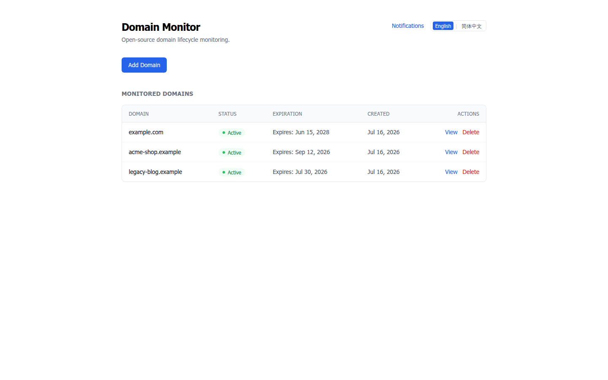
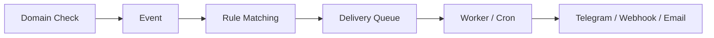
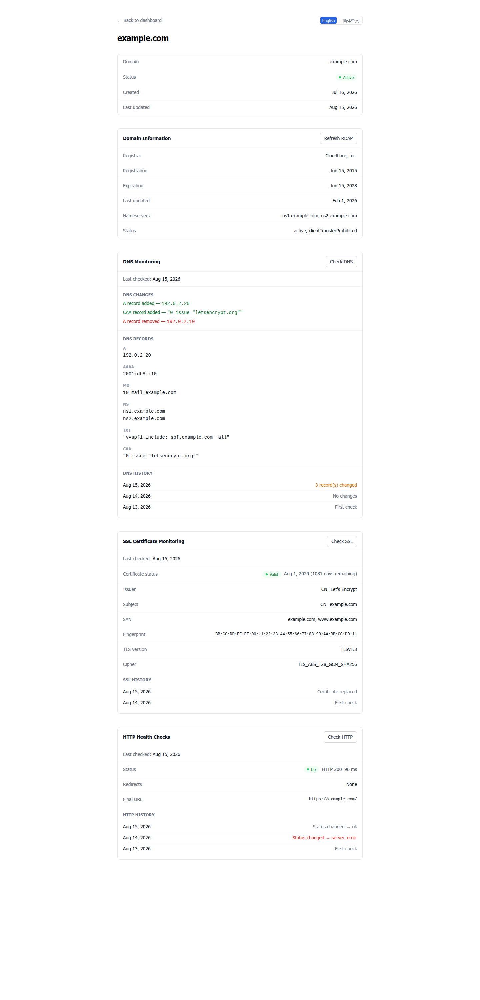
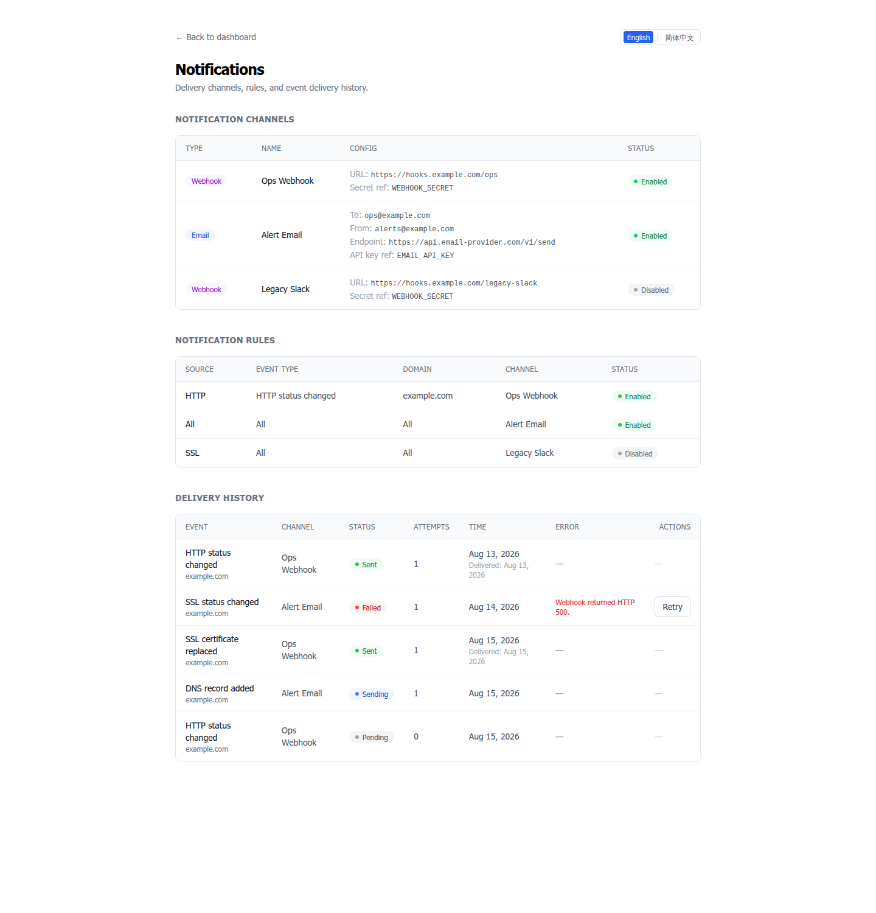

# Domain Monitor

[English](README.md) | [简体中文](README.zh-CN.md)

**Self-hosted domain monitoring for RDAP, DNS, SSL & HTTP.**

[](https://github.com/hxx0611/Domain-Monitor/actions/workflows/ci.yml)
[](LICENSE)
[](https://github.com/hxx0611/Domain-Monitor/releases)

Keep your domains under control: track registration data, detect DNS and SSL changes, catch HTTP failures — and get notified when something changes.

- **Event-driven notifications** — changes become events, events become notifications
- **Telegram / Webhook / Email** delivery to your tools
- **Manual expiration & reminders** — set expiry dates manually (RDAP or manual source), register a platform, and schedule expiration reminders
- **Delivery Worker** — one-shot CLI, schedule with cron, no daemon
- **Admin authentication** — setup wizard, login, one-time recovery code
- **English / 简体中文** UI



> Screenshots reflect an earlier release; the current UI adds admin authentication and Telegram channels.

## Why Domain-Monitor?

A domain is never just "up or down". The interesting questions are the changes in between:

- **DNS changes** — records added, removed, or changed (A / AAAA / CNAME / MX / NS / TXT / CAA)
- **SSL changes** — certificates expiring, replaced, or mismatched with the hostname
- **HTTP failures / recovery** — downtime, status changes, redirect drift
- **Registration information** — registrar, expiry, nameservers, RDAP status

Domain Monitor turns those changes into **events**, matches them against your **rules**, and delivers them as **notifications** — so you find out when something _changes_, not when it breaks.

## Quick Start

```bash
git clone https://github.com/hxx0611/Domain-Monitor.git
cd Domain-Monitor
pnpm install
cp .env.example .env
pnpm dev
```

Open [http://localhost:3000](http://localhost:3000).

Requires **Node.js 22 LTS or newer** (22 LTS recommended; 24 / 26 are CI-tested) and [pnpm](https://pnpm.io/). Works on Linux, macOS, and Windows. better-sqlite3 ships prebuilt binaries, so a plain `pnpm install` needs no Python or C++ build tools.

## Features

### Domain Intelligence

- Manage all monitored domains in one place — self-hosted local storage (SQLite)
- Automatic RDAP lookup on creation: registrar, expiry, nameservers, RDAP status (IANA bootstrap, 590+ TLDs)
- **Ownership-aware RDAP fallback**: when a subdomain has no independent RDAP object, the query falls back to the registered domain and reports `ownership = parent` — the parent's expiration/registrar/nameservers are **never** stored on the subdomain's own fields, and the UI shows `Unavailable` for the subdomain's registration info
- **Manual expiration** (source = `manual`): set registration date, expiration date, registration platform and management URL by hand — for domains whose RDAP data is unreliable, missing, or simply not what you want to display. Manual dates are **never overwritten** by RDAP refreshes (the refresh only updates RDAP metadata, or clears it for `no-object` / parent results)
- **Expiration reminders**: per-domain reminder rules (e.g. 30 days before expiry); the notification worker evaluates them and emits `expiration_reminder` events (see **Delivery Worker** below for the current availability note)
- Domain normalization and validation (accepts `https://example.com/path`, stores `example.com`)
- Manual RDAP refresh anytime

### DNS Monitoring

- DNS-over-HTTPS based monitoring (Cloudflare DoH, resolver swappable via `DNS_DOH_ENDPOINT`)
- Tracks A / AAAA / CNAME / MX / NS / TXT / CAA records
- Historical snapshots with added / removed record detection (TTL-only changes ignored)
- Atomic failed-check handling — a partial failure never deletes old data

### SSL Monitoring

- TLS certificate inspection (Node.js native TLS)
- Expiration tracking: valid / expires soon / expired
- Hostname mismatch detection (SAN vs queried domain)
- Certificate fingerprint / replacement detection, TLS version and cipher information

### HTTP Monitoring

- HTTP status classification and response-time tracking
- Redirect tracking (count and final URL)
- Connection-failure detection (down)
- Per-check history

### Notifications

- Domain lifecycle events from DNS / SSL / HTTP checks
- Channels: **Telegram**, **Email API**, and **Webhook**
- **Test notifications** (v0.8.4): admin-triggered `Send Test Notification` on each Telegram channel — exactly one event + one delivery + one message through the existing factory/sender/encrypted-secret pipeline, explicitly labelled `Test Notification`, never routed through rules or expiry logic
- **Channel-level notification language** (v0.8.6): per-channel `language` (`en` / `zh-CN`) selected in the channel edit form; message template and event labels are localized, machine state values stay canonical
- Rule-based delivery matching (global or per-domain rules, by source / event type — including the `expiration_reminder` event type)
- Notification configuration UI — channel CRUD (create / edit / toggle / delete), rule CRUD
- Telegram bot tokens validated via `getMe` (server-side) and stored **AES-256-GCM encrypted** (`ENCRYPTION_KEY`), with legacy `TELEGRAM_BOT_TOKEN` env fallback
- Delivery history with status tracking (pending / sending / sent / failed) and manual retry

### Admin Authentication

- One-time **setup wizard** (`/setup`) — creates the admin password (scrypt-hashed) and a one-time **recovery code**
- **HMAC-signed session cookie** — login / logout, protected pages and Server Actions
- Password recovery rotates the session secret, invalidating all old sessions

### Delivery Worker

> **Availability note (v0.8.3):** the worker is **enabled in production** — the hourly watchdog (`scripts/worker-watchdog.sh`) runs as a single instance and ticks every hour (`tsx --conditions=react-server scripts/worker.ts --limit 50`). Expiration-reminder evaluation and delivery are live; real notification delivery is exercised only through explicitly approved safety gates (no real Telegram/Webhook/Email sends have been performed as part of this release).

- One-shot CLI (`pnpm worker`) — schedule with cron or the bundled watchdog, no daemon, no HTTP endpoint
- **Automatic Event → Delivery generation inside the check transaction** (atomic)
- **Expiration reminders**: `evaluateExpirationReminders()` runs inside the worker tick and emits `expiration_reminder` events (source `expiration`) for domains whose reminder day has arrived, deduplicated so a domain is reminded once per day
- **Event → Delivery together**: `insertEventsAndGenerateDeliveries` creates the event and its deliveries in one step; concurrent ticks are safe (SQLite CAS) — at most one event, one delivery and one sender invocation per reminder per day
- Stale `sending` recovery (crash-safe) and concurrent-worker safety (SQLite CAS)

### Bilingual UI

- **English / 简体中文** language switching in the header
- Locale-aware UI dictionary; preference stored in the `domain-monitor-locale` cookie (`en` / `zh-CN`, default `en`)
- Cookie + Server Action + `router.refresh()` — no URL prefix, no middleware, no third-party i18n dependency
- Machine values (delivery status, event types, sources) are never translated

## How It Works



A check writes its snapshot, its events, and the matching pending deliveries in **one transaction**. The delivery worker claims pending deliveries (atomic CAS) and calls the senders. Retrying a failed delivery from the UI works end-to-end.



## Security by Design

- **Admin authentication** — protected pages and Server Actions; scrypt password hashing; signed session cookies; recovery-code rotation invalidates old sessions
- **Encrypted secret storage** — Telegram bot tokens are stored **AES-256-GCM encrypted** (`iv:tag:ciphertext`, keyed by `ENCRYPTION_KEY`); tokens are never rendered back into HTML/RSC/client bundles — only CONFIGURED/NOT CONFIGURED status is exposed
- **SSRF protection** — outbound requests are HTTPS-only, with per-redirect re-validation
- **HTTPS-only** outbound traffic, **redirect re-validation** on every hop
- **Secret isolation** — API keys / webhook secrets / bot tokens never appear in the UI, worker output, or client bundle
- **at-least-once** delivery with stable `eventId` + `deliveryId` for receiver-side deduplication

## Built for Reliability

- **763 tests** covering services, state machines, senders, the delivery worker, manual expiration & reminders, worker runtime fixes (barrel import + delivery generation), the i18n core, and admin authentication
- **780 tests** (v0.8.4) adds the controlled test-notification action contract (authorization, channel validation, dedup, single-send limits, leakage) and its real-DB integration path (encrypted-secret chain, sender success/failure, no domain/rule mutation)
- **SSRF-guarded** webhook and email senders
- **SQLite concurrency tested** — atomic claim (CAS) + `busy_timeout = 5000`
- **Self-hosted** — your data stays on your machine

## Current Status

**Current release: v0.8.3 — Production Worker & Expiration Reminder**

Supported today:

- Domain management
- RDAP information
- **Manual expiration** — set registration / expiration dates, registration platform and management URL manually; manual dates survive RDAP refreshes
- **Expiration reminders** — per-domain reminder days, evaluated by the worker as `expiration_reminder` events
- DNS monitoring
- SSL certificate monitoring
- HTTP health checks
- Notification system (telegram / email / webhook channels, rules — including `expiration_reminder` — delivery history, manual retry)
- Notification configuration UI (channel & rule CRUD, Telegram token setup with `getMe` verification)
- Delivery worker (automatic Event → Delivery → Send pipeline; **enabled in production** via the hourly watchdog — see the availability note above)
- Admin authentication (setup wizard, login/logout, recovery code, protected pages)
- Encrypted secret storage (AES-256-GCM, `ENCRYPTION_KEY`, legacy env fallback)
- Bilingual UI (English / 简体中文, cookie-based locale switching)

DNS, SSL and HTTP checks are currently manual; automatic scheduling is planned for a future release.

The notification pipeline is fully closed: a check writes its snapshot, its events, and the matching pending deliveries in ONE transaction; the delivery worker consumes those pending deliveries and calls the senders. Retrying a failed delivery from the UI works end-to-end.

## Delivery Worker (V0.7)



The delivery worker is a **one-shot CLI process** that consumes the `pending` deliveries the notification pipeline records. It is the recommended way to run notifications on a self-hosted deployment.

### Run it

```bash
pnpm worker             # one tick, up to 50 pending deliveries
pnpm worker --limit 10  # cap this tick at 10 deliveries
pnpm worker --limit=10  # same
```

The worker runs **one tick and exits** — it never stays resident, starts no interval, opens no HTTP endpoint, and keeps no background timers. It prints a single JSON summary line to stdout (exit 0), or a clear error to stderr (exit 1 for bad arguments or an uncaught error).

Summary shape (stable):

```json
{ "expirationEvents": 0, "recovered": 0, "attempted": 0, "sent": 0, "failed": 0, "skipped": 0 }
```

- `expirationEvents` — expiration-reminder events emitted this tick (V0.8.3)
- `recovered` — stale `sending` deliveries moved back to `pending` (crash recovery)
- `attempted` — deliveries this tick tried to deliver
- `sent` / `failed` / `skipped` — outcomes (`skipped` = a concurrent worker claimed it first)

The worker never prints secrets: no API keys, no `Authorization`/`Bearer` values, no channel config JSON, no endpoint query strings.

### Scheduling with cron

Recommended: the CLI worker plus an external scheduler (system cron or equivalent). Example crontab entry — adjust the path for your deployment:

```cron
* * * * * cd /path/to/Domain-Monitor && pnpm worker >> /var/log/domain-monitor-worker.log 2>&1
```

- Runs every minute; each run is a fresh one-shot process.
- An empty queue exits immediately.
- Default cap: 50 pending deliveries per tick.
- **No public HTTP endpoint is added** — scheduling stays fully external (no webhook scheduler endpoint, no serverless cron).
- Overlapping cron instances are safe: SQLite CAS guarantees only one worker ever claims a given delivery. Keep it at once per minute to avoid extra DB contention.

### Runtime semantics

- **Check → Event** — recorded by the V0.6 pipeline (per-check transaction, deduplicated).
- **Event → Delivery** — automatic since V0.7: the check transaction creates the matching pending deliveries for every newly-recorded event (rule-matched, channel-deduplicated). Duplicate events (same dedup key) never re-generate deliveries.
- **Delivery → Send** — the worker claims `pending` deliveries (atomic CAS) and calls the existing senders.
- **failed** — the worker does **not** auto-retry failed deliveries; no backoff, no max-attempts.
- **retry** — explicit only: `retryDelivery()` / the notification UI.
- **stale sending** — the worker runs `recoverStaleSending()` at the start of every tick; the default stale threshold is **5 minutes**.
- **at-least-once** — a crash mid-send leaves `sending`, which the next tick recovers and sends again, so a delivery can be sent more than once. Receivers must deduplicate using the stable `eventId` + `deliveryId` in the payload. This is at-least-once, **not** exactly-once.
- **historical events** — V0.7 does NOT backfill deliveries for events recorded before the upgrade; the worker only consumes the current `pending` queue.
- SQLite `busy_timeout = 5000` is enabled so the worker and the web app can write concurrently without immediate `SQLITE_BUSY` failures.
- No daemon, no automatic retry, no backoff, no max-attempts, no distributed queue (Redis/Kafka), no HTTP scheduler endpoint, no serverless scheduler, no SLA/uptime monitoring.

## Testing

```bash
pnpm test
```

Current test suite: **800 tests (54 files)**, covering domain validation (including manual expiration fields and reminder-day normalization), RDAP parsing and fallback ownership semantics, registration-platform validation, DNS normalization and diffing, SSL certificate parsing and diffing, HTTP status classification and SSRF-guarded fetching, the DNS/SSL/HTTP services, the notification event/rule/delivery state machine (including the `expiration_reminder` event type), SSRF-guarded webhook and email senders, automatic Event → Delivery generation, expiration-reminder evaluation, the delivery worker (including concurrent-tick dedup / CAS E2E), the controlled test-notification action (authorization, channel validation, dedup, single-send limits, secret leakage), admin authentication (sessions, setup/login/recovery), encrypted secret storage, Telegram sender secret resolution, the locale-aware i18n core (dictionaries, cookie fallback, client/server boundary), and the data repositories.

Also run before pushing changes:

```bash
pnpm lint
pnpm format:check
pnpm build
```

## Architecture

```
UI (Next.js App Router)
        ↓
Server Actions
        ↓
Domain / RDAP / DNS services
        ↓
Repository
        ↓
SQLite
```

- **Next.js App Router** + Server Actions
- **Drizzle ORM** with **SQLite** (migrations in `src/db/migrations/`)
- **Cloudflare DoH** for DNS queries (resolver swappable via `DNS_DOH_ENDPOINT`)
- **IANA RDAP bootstrap** for registration data

See [docs/development.md](docs/development.md) for detailed development notes.

## Database

SQLite via Drizzle ORM. Manage the schema with the built-in commands:

```bash
pnpm db:generate   # Generate migration files
pnpm db:migrate    # Run migrations
pnpm db:studio     # Open the visual database browser
```

## Roadmap

- [x] **V0.1** — Domain management
- [x] **V0.2** — RDAP / WHOIS integration
- [x] **V0.3** — DNS monitoring
- [x] **V0.4** — SSL certificate monitoring
- [x] **V0.5** — HTTP health checks
- [x] **V0.6** — Notification system
- [x] **V0.7** — Notification delivery worker
- [x] **V0.7.1** — Bilingual UI
- [x] **V0.7.3** — Monitoring error clarity
- [x] **V0.8.0** — Admin authentication, Telegram notifications & encrypted secrets
- [x] **V0.8.1** — RDAP ownership & expiration fixes (bugfix release)
- [x] **V0.8.2** — Manual expiration, registration platform & expiration reminders (worker delivery enabled in production in v0.8.3)
- [x] **V0.8.3** — Production Worker enablement (hourly watchdog, expiration reminder delivery pipeline, worker runtime fixes) + migration journal repair for 0007

## Contributing

Contributions are welcome.

```bash
pnpm install
pnpm test
pnpm lint
pnpm build
```

See [CONTRIBUTING.md](CONTRIBUTING.md) for the full contribution guide.

## License

[MIT](LICENSE)
