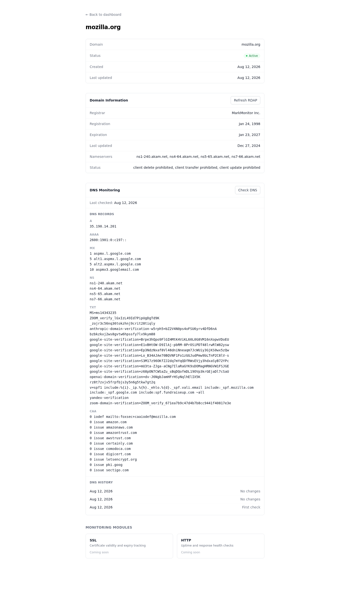

# Domain Monitor

A lightweight, self-hostable domain lifecycle monitoring platform for RDAP, DNS, and domain status tracking.

[](https://github.com/hxx0611/Domain-Monitor/actions/workflows/ci.yml)
[](LICENSE)
[](https://github.com/hxx0611/Domain-Monitor/releases)

Domain Monitor helps you keep track of the domains you own: it stores them locally, looks up registration data via RDAP, and lets you run DNS checks to see how your records evolve over time.

## Screenshots

Domain details view with RDAP information, DNS records, and DNS change history.



## Features

### Domain Management

- Add and manage monitored domains
- Domain normalization and validation (accepts `https://example.com/path`, stores `example.com`)
- Self-hosted local storage (SQLite)
- Domain detail pages

### RDAP Information

- Automatic RDAP lookup on domain creation
- IANA bootstrap routing (590+ TLDs)
- Registrar information
- Registration / expiration / last-updated dates
- Nameservers and RDAP status
- Manual RDAP refresh

### DNS Monitoring

- DNS-over-HTTPS based monitoring (Cloudflare DoH)
- A / AAAA / CNAME / MX / NS / TXT / CAA records
- Historical DNS snapshots
- Added / removed record detection
- TTL-only changes ignored
- Atomic failed-check handling (a partial failure never deletes old data)
- Manual DNS checks

### SSL Certificate Monitoring

- TLS certificate inspection (Node.js native TLS)
- Certificate expiration / status tracking (valid, expires soon, expired)
- Hostname mismatch detection (SAN vs queried domain)
- Certificate fingerprint / replacement detection
- TLS version and cipher information
- SSL check history
- Manual SSL checks

### HTTP Health Checks

- HTTP status monitoring (status code classification)
- Response-time tracking
- Redirect tracking (count and final URL)
- Connection-failure detection (down)
- HTTP check history
- Manual HTTP checks

### Notification System

- Domain lifecycle events (DNS / SSL / HTTP check events)
- Notification channels: **Email API** and **Webhook**
- Rule-based delivery matching (global or per-domain rules)
- Delivery history with status tracking (pending / sending / sent / failed)
- Manual retry for failed deliveries
- SSRF-guarded outbound requests (HTTPS only, per-redirect re-validation)

### Delivery Worker

- One-shot CLI worker (`pnpm worker`) that consumes `pending` deliveries
- **Automatic Event → Delivery generation inside the check transaction**
  (DNS / SSL / HTTP checks create their matching deliveries atomically)
- Stale `sending` recovery (crash-safe, 5-minute default threshold)
- Concurrent-worker safe via atomic claim (SQLite CAS)
- `busy_timeout = 5000` for multi-process SQLite writes

## Current Status

**Current release: v0.7.0 — Notification System + Delivery Worker**

Supported today:

- Domain management
- RDAP information
- DNS monitoring
- SSL certificate monitoring
- HTTP health checks
- Notification system (email / webhook channels, rules, delivery history, manual retry)
- Delivery worker (automatic Event → Delivery → Send pipeline, one-shot CLI + external cron)

DNS, SSL and HTTP checks are currently manual; automatic scheduling is planned for a future release.

The notification pipeline is fully closed: a check writes its snapshot, its events, and the matching pending deliveries in ONE transaction; the delivery worker consumes those pending deliveries and calls the senders. Retrying a failed delivery from the UI works end-to-end.

## Notification Worker (V0.7)

The delivery worker is a **one-shot CLI process** that consumes the `pending` deliveries the notification pipeline records. It is the recommended way to run notifications on a self-hosted deployment.

### Run it

```bash
pnpm worker             # one tick, up to 50 pending deliveries
pnpm worker --limit 10  # cap this tick at 10 deliveries
pnpm worker --limit=10  # same
```

The worker runs **one tick and exits** — it never stays resident, starts no interval, opens no HTTP endpoint, and keeps no background timers. It prints a single JSON summary line to stdout (exit 0), or a clear error to stderr (exit 1 for bad arguments or an uncaught error).

Summary shape (stable):

```json
{ "recovered": 0, "attempted": 0, "sent": 0, "failed": 0, "skipped": 0 }
```

- `recovered` — stale `sending` deliveries moved back to `pending` (crash recovery)
- `attempted` — deliveries this tick tried to deliver
- `sent` / `failed` / `skipped` — outcomes (`skipped` = a concurrent worker claimed it first)

The worker never prints secrets: no API keys, no `Authorization`/`Bearer` values, no channel config JSON, no endpoint query strings.

### Scheduling with cron

Recommended: the CLI worker plus an external scheduler (system cron or equivalent). Example crontab entry — adjust the path for your deployment:

```cron
* * * * * cd /path/to/Domain-Monitor && pnpm worker >> /var/log/domain-monitor-worker.log 2>&1
```

- Runs every minute; each run is a fresh one-shot process.
- An empty queue exits immediately.
- Default cap: 50 pending deliveries per tick.
- **No public HTTP endpoint is added** — scheduling stays fully external (no webhook scheduler endpoint, no serverless cron).
- Overlapping cron instances are safe: SQLite CAS guarantees only one worker ever claims a given delivery. Keep it at once per minute to avoid extra DB contention.

### Runtime semantics

- **Check → Event** — recorded by the V0.6 pipeline (per-check transaction, deduplicated).
- **Event → Delivery** — automatic since V0.7: the check transaction creates the matching pending deliveries for every newly-recorded event (rule-matched, channel-deduplicated). Duplicate events (same dedup key) never re-generate deliveries.
- **Delivery → Send** — the worker claims `pending` deliveries (atomic CAS) and calls the existing senders.
- **failed** — the worker does **not** auto-retry failed deliveries; no backoff, no max-attempts.
- **retry** — explicit only: `retryDelivery()` / the notification UI.
- **stale sending** — the worker runs `recoverStaleSending()` at the start of every tick; the default stale threshold is **5 minutes**.
- **at-least-once** — a crash mid-send leaves `sending`, which the next tick recovers and sends again, so a delivery can be sent more than once. Receivers must deduplicate using the stable `eventId` + `deliveryId` in the payload. This is at-least-once, **not** exactly-once.
- **historical events** — V0.7 does NOT backfill deliveries for events recorded before the upgrade; the worker only consumes the current `pending` queue.
- SQLite `busy_timeout = 5000` is enabled so the worker and the web app can write concurrently without immediate `SQLITE_BUSY` failures.
- No daemon, no automatic retry, no backoff, no max-attempts, no distributed queue (Redis/Kafka), no HTTP scheduler endpoint, no serverless scheduler, no SLA/uptime monitoring.

## Quick Start

```bash
git clone https://github.com/hxx0611/Domain-Monitor.git
cd Domain-Monitor
pnpm install
cp .env.example .env
pnpm dev
```

Open [http://localhost:3000](http://localhost:3000).

Requires Node.js >= 18 and [pnpm](https://pnpm.io/). Works on Linux, macOS, and Windows.

## Testing

```bash
pnpm test
```

Current test suite: **448 tests**, covering domain validation, RDAP parsing, DNS normalization and diffing, SSL certificate parsing and diffing, HTTP status classification and SSRF-guarded fetching, the DNS/SSL/HTTP services, the notification event/rule/delivery state machine, SSRF-guarded webhook and email senders, automatic Event → Delivery generation, the delivery worker, and the data repositories.

Also run before pushing changes:

```bash
pnpm lint
pnpm format:check
pnpm build
```

## Architecture

```
UI (Next.js App Router)
        ↓
Server Actions
        ↓
Domain / RDAP / DNS services
        ↓
Repository
        ↓
SQLite
```

- **Next.js App Router** + Server Actions
- **Drizzle ORM** with **SQLite** (migrations in `src/db/migrations/`)
- **Cloudflare DoH** for DNS queries (resolver swappable via `DNS_DOH_ENDPOINT`)
- **IANA RDAP bootstrap** for registration data

See [docs/development.md](docs/development.md) for detailed development notes.

## Database

SQLite via Drizzle ORM. Manage the schema with the built-in commands:

```bash
pnpm db:generate   # Generate migration files
pnpm db:migrate    # Run migrations
pnpm db:studio     # Open the visual database browser
```

## Roadmap

- [x] **V0.1** — Domain management
- [x] **V0.2** — RDAP / WHOIS integration
- [x] **V0.3** — DNS monitoring
- [x] **V0.4** — SSL certificate monitoring
- [x] **V0.5** — HTTP health checks
- [x] **V0.6** — Notification system
- [x] **V0.7** — Notification delivery worker

## Contributing

Contributions are welcome.

```bash
pnpm install
pnpm test
pnpm lint
pnpm build
```

See [CONTRIBUTING.md](CONTRIBUTING.md) for the full contribution guide.

## License

[MIT](LICENSE)
