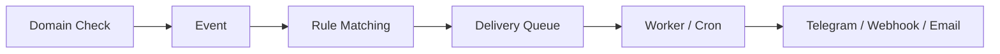

# Domain Monitor

[English](README.md) | [简体中文](README.zh-CN.md)

**Self-hosted domain monitoring for RDAP, DNS, SSL & HTTP.**

[](https://github.com/hxx0611/Domain-Monitor/actions/workflows/ci.yml)
[](LICENSE)
[](https://github.com/hxx0611/Domain-Monitor/releases)

Keep your domains under control: track registration data, detect DNS and SSL changes, catch HTTP failures — and get notified when something changes.

- **Event-driven notifications** — changes become events, events become notifications
- **Telegram / Webhook / Email** delivery to your tools
- **Manual expiration & reminders** — set expiry dates manually (RDAP or manual source), register a platform, and schedule expiration reminders
- **Delivery Worker** — one-shot CLI, schedule with cron, no daemon
- **Admin authentication** — setup wizard, login, one-time recovery code
- **English / 简体中文** UI


> Screenshots reflect an earlier release; the current UI adds admin authentication and Telegram channels.

## Why Domain-Monitor?

A domain is never just "up or down". The interesting questions are the changes in between:

- **DNS changes** — records added, removed, or changed (A / AAAA / CNAME / MX / NS / TXT / CAA)
- **SSL changes** — certificates expiring, replaced, or mismatched with the hostname
- **HTTP failures / recovery** — downtime, status changes, redirect drift
- **Registration information** — registrar, expiry, nameservers, RDAP status

Domain Monitor turns those changes into **events**, matches them against your **rules**, and delivers them as **notifications** — so you find out when something _changes_, not when it breaks.

## Quick Start

```bash
git clone https://github.com/hxx0611/Domain-Monitor.git
cd Domain-Monitor
pnpm install
cp .env.example .env
pnpm dev
```

Open [http://localhost:3000](http://localhost:3000).

Requires **Node.js 22 LTS or newer** (22 LTS recommended; 24 / 26 are CI-tested) and [pnpm](https://pnpm.io/). Works on Linux, macOS, and Windows. better-sqlite3 ships prebuilt binaries, so a plain `pnpm install` needs no Python or C++ build tools.

> **There are two ways to run this project — pick one, don't mix the command sets:**
>
> - **Option A — Local / Node** (above): `better-sqlite3` + SQLite, `pnpm dev` / `pnpm build` / `pnpm start`, database stored in a local file `data/domain-monitor.db`.
> - **Option B — Cloudflare Production** (the whole section below): Cloudflare Worker + OpenNext + D1, `custom-worker.ts` + `scheduled()`, database in cloud D1. **If your goal is a Cloudflare deployment, keep reading and do NOT use the local commands above.**

---

## Cloudflare Production Deployment (Option B)

> This section is written for people who have **never used Cloudflare Workers / D1 / OpenNext**. Follow every step in order, don't skip any.
> When done, you will have a **fully self-owned** Cloudflare deployment (your own Worker, your own D1, your own domain) — you will not touch anyone else's production resources.

> 🚨🚨🚨 **READ THIS BEFORE YOU START (SAFETY WARNING)** 🚨🚨🚨
>
> 1. **Never use the `database_id` from the repo's `wrangler.prod.jsonc`.** It is the **author's production database ID** — it does not exist in your account and deploying with it will fail; if you ever run it against the author's account it could touch the author's production data. **You must create your own D1 and replace `database_id` with yours** (see Step 3).
> 2. **If a Worker or D1 named `domain-monitor` already exists in your Cloudflare account** (e.g. you deployed before), `wrangler d1 create domain-monitor` will conflict and `wrangler deploy` will **overwrite your existing Worker of the same name**. Use a unique name instead, e.g. `domain-monitor-yourname`, and keep the Worker name, D1 name, the `"name"`/`database_name` in `wrangler.prod.jsonc`, and every command below **consistent**.
> 3. **Never run `wrangler secret put`, `wrangler deploy`, or any other mutating command against a Worker you don't own.** First confirm the current Cloudflare account is yours.

### 0. Prerequisites

- A [Cloudflare](https://dash.cloudflare.com/) account (the free tier is enough)
- A domain (recommended but optional; you can validate on a `*.workers.dev` temporary domain first)
- Node.js 22+ and pnpm (same as above)
- A machine with `bash`; Windows users see section 7 for the PowerShell build command

### 1. Clone and install

```bash
git clone https://github.com/hxx0611/Domain-Monitor.git
cd Domain-Monitor
pnpm install
```

Wrangler (Cloudflare's official CLI) and the OpenNext Cloudflare adapter are **not** formal project dependencies, so install them as dev dependencies:

```bash
pnpm add -D wrangler @opennextjs/cloudflare
```

> ⚠️ **pnpm 11 requires approving workerd's build script**: wrangler depends on `workerd`, and pnpm 11 blocks dependency postinstall scripts by default, so you may see `ERR_PNPM_IGNORED_BUILDS: Ignored build scripts: workerd`. If you don't approve it, the OpenNext build below will fail.
>
> **Recommended (simplest, won't break the file): run**
>
> ```bash
> pnpm approve-builds
> ```
>
> Select `workerd` when prompted, then re-run `pnpm install`.
>
> **Alternative (manual edit of `pnpm-workspace.yaml`)**:
>
> 1. Open `pnpm-workspace.yaml` and check whether pnpm already inserted a placeholder line (e.g. `workerd: set this to true or false`);
> 2. **If a `workerd` entry already exists: change its value to `workerd: true` — never add a second line**;
> 3. **If no `workerd` entry exists: append one line `workerd: true` under `allowBuilds:`** (match the existing indentation).
>
> ⚠️ **Do not** add `allowBuilds:` or `workerd:` twice in the same YAML file — duplicate keys make `pnpm install` fail with `duplicated mapping key`. Re-run `pnpm install` after editing and confirm the warning is gone.

Verify:

```bash
pnpm exec wrangler --version            # should print 4.x
pnpm exec opennextjs-cloudflare --help  # should print help
```

### 2. Create a Cloudflare API Token

Cloudflare Dashboard → **My Profile → API Tokens → Create Token**, use the **“Edit Cloudflare Workers”** template (or create a custom token), and grant at least these permissions (all **Edit**):

| Resource | Permission | Purpose |
|---|---|---|
| Account → Workers Scripts | Edit | Upload/update the Worker |
| Account → D1 | Edit | Create/manage the D1 database |
| Zone → Workers Routes (optional) | Edit | Bind a custom domain |
| Zone → Zone (optional) | Read | Read your domain zone |

Export the token as environment variables (**never put it into the repo, `.env`, `wrangler.prod.jsonc`, or any config file**):

```bash
export CLOUDFLARE_API_TOKEN=your-token
export CLOUDFLARE_ACCOUNT_ID=your-account-id   # from the Dashboard footer
```

(Or use `wrangler login` browser auth instead — pick one.)

### 3. Create your own D1 database ⚠️ most important

> ⚠️ **If a D1 or Worker named `domain-monitor` already exists in your account, use a unique name** instead, e.g. `domain-monitor-yourname` (replace `yourname` with your own identifier). **Never overwrite resources that are not yours.** Replace `domain-monitor` with your unique name in every command below.

```bash
pnpm exec wrangler d1 create domain-monitor
```

Output looks like:

```
✅ Successfully created DB 'domain-monitor' in region APAC
Created your new D1 database.
[[d1_databases]]
binding = "DB"
database_name = "domain-monitor"
database_id = "<YOUR_DATABASE_ID>"
```

> ⚠️ **Never use the `database_id` already present in the repo's `wrangler.prod.jsonc`** (it belongs to the author's production environment; it doesn't exist in your account and deploying with it will fail — or worse, could touch the author's production data if you ever run it against that account). **Copy the `<YOUR_DATABASE_ID>` from the output above.**

Open `wrangler.prod.jsonc` and replace `d1_databases[0].database_id` with your own `<YOUR_DATABASE_ID>` (keep `binding = "DB"`). **If you used a unique name** (e.g. `domain-monitor-yourname`), also change `d1_databases[0].database_name` and the top-level `"name"` to that same name — **the Worker name, D1 name, config file, and every command below must be consistent**.

### 4. Apply D1 migrations

> Run this **from the repo root** (after `cd Domain-Monitor`) and **always pass `--config wrangler.prod.jsonc`** — there is no default `wrangler.jsonc` at the repo root, so omitting `--config` fails with `No configuration file found`.

```bash
pnpm exec wrangler d1 migrations apply domain-monitor --remote --config wrangler.prod.jsonc
```

- This applies `src/db/migrations/` to the D1 database **you just created** (`--remote` = cloud).
- You should see 0000–0007 all applied.
- ⚠️ **`pnpm db:migrate` is a local SQLite migration and does NOT replace this step**; it never touches Cloudflare D1.

### 5. Set Secrets (ENCRYPTION_KEY / SESSION_SECRET)

- `ENCRYPTION_KEY`: encrypts sensitive data such as Telegram tokens (AES-256-GCM). **Once set, losing it makes the encrypted data unrecoverable.**
- `SESSION_SECRET`: signs login sessions (cookies).

> Run from the repo root and **always pass `--config wrangler.prod.jsonc`** so the secrets are written to **your** Worker (the one you named in Step 3).

```bash
openssl rand -hex 32 | pnpm exec wrangler secret put ENCRYPTION_KEY --config wrangler.prod.jsonc
openssl rand -hex 32 | pnpm exec wrangler secret put SESSION_SECRET --config wrangler.prod.jsonc
```

On Windows PowerShell, if `openssl` is not available, generate the 64-hex value first and paste it when prompted:

```powershell
-join ([System.Security.Cryptography.RandomNumberGenerator]::GetBytes(32) | ForEach-Object { $_.ToString("x2") })
```

> Each command prompts for the secret; paste the 64-hex value. These values are **never written to git, README, `.env`, or any config file** — they live only in Cloudflare Secrets.
>
> ⚠️ **Never run `wrangler secret put` against a Worker you don't own** — it writes the secret to that Worker and overwrites any existing value. Before running, confirm the `"name"` in `wrangler.prod.jsonc` is your own Worker name.

### 6. Clean old build cache

**Before every Cloudflare build** (reason in section 8):

```bash
rm -rf .next .open-next
```

Windows PowerShell:

```powershell
Remove-Item -Recurse -Force .next,.open-next
```

### 7. Build OpenNext (Cloudflare) artifacts

```bash
OPENNEXT_CLOUDFLARE=1 SKIP_WRANGLER_CONFIG_CHECK=yes pnpm exec opennextjs-cloudflare build
```

Windows PowerShell (same build command, environment variables set via `$env:`):

```powershell
$env:OPENNEXT_CLOUDFLARE="1"
$env:SKIP_WRANGLER_CONFIG_CHECK="yes"
pnpm exec opennextjs-cloudflare build
Remove-Item Env:OPENNEXT_CLOUDFLARE,Env:SKIP_WRANGLER_CONFIG_CHECK
```

- **`OPENNEXT_CLOUDFLARE=1` is not optional**: it makes Next.js use `tsconfig.cf.json`'s stub aliases (redirecting `@/db` to the Cloudflare stub) and makes webpack redirect `@/db` / `@/db/node-singleton` to the stub, so **better-sqlite3 and other Node/SQLite dependencies never enter the Cloudflare Worker bundle**. Without it the build mixes in Node/SQLite runtime code and the deployed Worker fails at runtime.
- `SKIP_WRANGLER_CONFIG_CHECK=yes`: the repo root only has `wrangler.prod.jsonc` (OpenNext only looks for `wrangler.jsonc`/`wrangler.toml` at the root by default), so we skip OpenNext's own config-existence check. **This does not affect `wrangler deploy`** (deploy explicitly uses `--config wrangler.prod.jsonc`).
- Success: `.open-next/worker.js` and `.open-next/assets/` (with `BUILD_ID`) exist.

> Why clean the cache first: if you previously ran a plain `pnpm build` without `OPENNEXT_CLOUDFLARE=1`, the `.next` cache may contain Node/SQLite-path build results; reusing it pollutes the Cloudflare artifacts. **Deleting `.next .open-next` before building is a cheap, reliable safeguard.**

### 8. dry-run / bundle safety verification (recommended)

```bash
pnpm exec wrangler deploy --config wrangler.prod.jsonc --dry-run
```

- Success: output shows `Read N files from the assets directory .open-next/assets`, `env.DB` / `env.ASSETS` bindings, and `--dry-run: exiting now`.
- Advanced (optional): export the final bundle and confirm there is no SQLite runtime:

```bash
pnpm exec wrangler deploy --config wrangler.prod.jsonc --dry-run --outdir /tmp/dm-bundle
grep -c "new Database(" /tmp/dm-bundle/custom-worker.js   # expect 0
grep -c "better-sqlite3" /tmp/dm-bundle/custom-worker.js  # only allowed inside drizzle-orm package path strings
```

> Cloudflare deployments use **D1**, not better-sqlite3/SQLite. The bundle must not contain runtime references to `new Database(` / `DATABASE_URL` / `node:sqlite`.

### 9. Deploy the Worker

```bash
pnpm exec wrangler deploy --config wrangler.prod.jsonc
```

- Order matters: **build first (section 7)** so `.open-next/assets` exists; otherwise `assets.directory .open-next/assets does not exist` fails immediately.
- Output shows `Uploaded domain-monitor` / `Deployed domain-monitor` plus a version.
- ⚠️ **Final check before deploying**: the top-level `"name"` in `wrangler.prod.jsonc` must be **your own Worker name** (default `domain-monitor`, or `domain-monitor-yourname` if you used a unique name). `wrangler deploy` **uploads/overwrites** the Worker with that name — **never** overwrite someone else's Worker of the same name.

### 10. Cron scheduling

`wrangler.prod.jsonc` already includes:

```jsonc
"triggers": { "crons": ["0 * * * *"] }   // every hour on the hour
```

- After deployment Cron is **managed automatically by Cloudflare** — no Linux cron needed.
- The Cloudflare production entry point is the Worker's `scheduled()` (which calls `runOnce` via D1); this is **not** the local `pnpm worker`.

### 11. Bind a domain

- **Verify first**: `https://domain-monitor.<your-workers-subdomain>.workers.dev` should load (if you used a unique name, use `https://domain-monitor-yourname.<your-workers-subdomain>.workers.dev`).
- **Then bind a custom domain** (optional, recommended): Dashboard → Workers & Pages → your Worker → **Settings → Domains & Routes → Add → Custom Domain**, enter `monitor.<your-domain>` and confirm the automatic DNS setup.

- ⚠️ **Do not copy the author's domain** (e.g. `monitor.snooze.eu.cc`) — use your own.

### 12. First-visit initialization (/setup)

Open `https://monitor.<your-domain>` (or the workers.dev URL):

1. If unconfigured you are redirected to `/setup` → create the admin account
2. **Save the recovery code** (the only credential to reset your password; shown once)
3. Log in
4. **Notifications → add a Telegram channel**: paste the Bot Token; the system verifies it via Telegram `getMe`, then stores it encrypted with AES-256-GCM
5. **The Telegram Bot Token does not go into `.env`** — it lives only in your D1 database (encrypted)

### 13. Deployment success Checklist

- [ ] Git clone completed
- [ ] `pnpm install` completed
- [ ] `pnpm exec wrangler --version` works
- [ ] `pnpm exec opennextjs-cloudflare --help` works
- [ ] Your own D1 created
- [ ] `wrangler.prod.jsonc` `database_id` is **your** `<YOUR_DATABASE_ID>`
- [ ] `wrangler d1 migrations apply --remote --config wrangler.prod.jsonc` succeeded (0000–0007)
- [ ] `ENCRYPTION_KEY` configured (`wrangler secret put`)
- [ ] `SESSION_SECRET` configured (`wrangler secret put`)
- [ ] `.next` / `.open-next` cleaned
- [ ] `OPENNEXT_CLOUDFLARE=1` build succeeded
- [ ] `.open-next/worker.js` exists
- [ ] `.open-next/assets/` exists
- [ ] `wrangler deploy --dry-run` succeeded
- [ ] Worker deployed
- [ ] Cron configured (`0 * * * *`, Cloudflare-managed)
- [ ] Custom domain reachable (or workers.dev reachable)
- [ ] `/setup` reachable
- [ ] Admin created
- [ ] Recovery code saved
- [ ] Telegram channel verified

---

[Back to top](#domain-monitor)

## Features

### Domain Intelligence

- Manage all monitored domains in one place — self-hosted local storage (SQLite)
- Automatic RDAP lookup on creation: registrar, expiry, nameservers, RDAP status (IANA bootstrap, 590+ TLDs)
- **Ownership-aware RDAP fallback**: when a subdomain has no independent RDAP object, the query falls back to the registered domain and reports `ownership = parent` — the parent's expiration/registrar/nameservers are **never** stored on the subdomain's own fields, and the UI shows `Unavailable` for the subdomain's registration info
- **Manual expiration** (source = `manual`): set registration date, expiration date, registration platform and management URL by hand — for domains whose RDAP data is unreliable, missing, or simply not what you want to display. Manual dates are **never overwritten** by RDAP refreshes (the refresh only updates RDAP metadata, or clears it for `no-object` / parent results)
- **Expiration reminders**: per-domain reminder rules (e.g. 30 days before expiry); the notification worker evaluates them and emits `expiration_reminder` events (see **Delivery Worker** below for the current availability note)
- Domain normalization and validation (accepts `https://example.com/path`, stores `example.com`)
- Manual RDAP refresh anytime

### DNS Monitoring

- DNS-over-HTTPS based monitoring (Cloudflare DoH, resolver swappable via `DNS_DOH_ENDPOINT`)
- Tracks A / AAAA / CNAME / MX / NS / TXT / CAA records
- Historical snapshots with added / removed record detection (TTL-only changes ignored)
- Atomic failed-check handling — a partial failure never deletes old data

### SSL Monitoring

- TLS certificate inspection (Node.js native TLS)
- Expiration tracking: valid / expires soon / expired
- Hostname mismatch detection (SAN vs queried domain)
- Certificate fingerprint / replacement detection, TLS version and cipher information

### HTTP Monitoring

- HTTP status classification and response-time tracking
- Redirect tracking (count and final URL)
- Connection-failure detection (down)
- Per-check history

### Notifications

- Domain lifecycle events from DNS / SSL / HTTP checks
- Channels: **Telegram**, **Email API**, and **Webhook**
- **Test notifications** (v0.8.4): admin-triggered `Send Test Notification` on each Telegram channel — exactly one event + one delivery + one message through the existing factory/sender/encrypted-secret pipeline, explicitly labelled `Test Notification`, never routed through rules or expiry logic
- **Channel-level notification language** (v0.8.6): per-channel `language` (`en` / `zh-CN`) selected in the channel edit form; message template and event labels are localized, machine state values stay canonical
- **Channel-level notification timezone** (v0.8.7): per-channel IANA `timezone` (default `UTC`) selected in the channel edit form; the Telegram message timestamp renders as `YYYY-MM-DD HH:mm:ss (Timezone)` via `Intl.DateTimeFormat` (DST-aware), internal storage stays UTC
- Rule-based delivery matching (global or per-domain rules, by source / event type — including the `expiration_reminder` event type)
- Notification configuration UI — channel CRUD (create / edit / toggle / delete), rule CRUD
- Telegram bot tokens validated via `getMe` (server-side) and stored **AES-256-GCM encrypted** (`ENCRYPTION_KEY`), with legacy `TELEGRAM_BOT_TOKEN` env fallback
- Delivery history with status tracking (pending / sending / sent / failed) and manual retry

### Admin Authentication

- One-time **setup wizard** (`/setup`) — creates the admin password (scrypt-hashed) and a one-time **recovery code**
- **HMAC-signed session cookie** — login / logout, protected pages and Server Actions
- Password recovery rotates the session secret, invalidating all old sessions

### Delivery Worker

> **Availability note (v0.8.3):** the worker is **enabled in production** — the hourly watchdog (`scripts/worker-watchdog.sh`) runs as a single instance and ticks every hour (`tsx --conditions=react-server scripts/worker.ts --limit 50`). Expiration-reminder evaluation and delivery are live; real notification delivery is exercised only through explicitly approved safety gates (no real Telegram/Webhook/Email sends have been performed as part of this release).

- One-shot CLI (`pnpm worker`) — schedule with cron or the bundled watchdog, no daemon, no HTTP endpoint
- **Automatic Event → Delivery generation inside the check transaction** (atomic)
- **Expiration reminders**: `evaluateExpirationReminders()` runs inside the worker tick and emits `expiration_reminder` events (source `expiration`) for domains whose reminder day has arrived, deduplicated so a domain is reminded once per day
- **Event → Delivery together**: `insertEventsAndGenerateDeliveries` creates the event and its deliveries in one step; concurrent ticks are safe (SQLite CAS) — at most one event, one delivery and one sender invocation per reminder per day
- Stale `sending` recovery (crash-safe) and concurrent-worker safety (SQLite CAS)

### Bilingual UI

- **English / 简体中文** language switching in the header
- Locale-aware UI dictionary; preference stored in the `domain-monitor-locale` cookie (`en` / `zh-CN`, default `en`)
- Cookie + Server Action + `router.refresh()` — no URL prefix, no middleware, no third-party i18n dependency
- Machine values (delivery status, event types, sources) are never translated

## How It Works



A check writes its snapshot, its events, and the matching pending deliveries in **one transaction**. The delivery worker claims pending deliveries (atomic CAS) and calls the senders. Retrying a failed delivery from the UI works end-to-end.


## Security by Design

- **Admin authentication** — protected pages and Server Actions; scrypt password hashing; signed session cookies; recovery-code rotation invalidates old sessions
- **Encrypted secret storage** — Telegram bot tokens are stored **AES-256-GCM encrypted** (`iv:tag:ciphertext`, keyed by `ENCRYPTION_KEY`); tokens are never rendered back into HTML/RSC/client bundles — only CONFIGURED/NOT CONFIGURED status is exposed
- **SSRF protection** — outbound requests are HTTPS-only, with per-redirect re-validation
- **HTTPS-only** outbound traffic, **redirect re-validation** on every hop
- **Secret isolation** — API keys / webhook secrets / bot tokens never appear in the UI, worker output, or client bundle
- **at-least-once** delivery with stable `eventId` + `deliveryId` for receiver-side deduplication

## Built for Reliability

- **849 tests** covering services, state machines, senders, the delivery worker, manual expiration & reminders, worker runtime fixes (barrel import + delivery generation), the i18n core, admin authentication, domain/DNS action coverage, and the production backup mechanism
- **780 tests** (v0.8.4) adds the controlled test-notification action contract (authorization, channel validation, dedup, single-send limits, leakage) and its real-DB integration path (encrypted-secret chain, sender success/failure, no domain/rule mutation)
- **813 tests** (v0.8.7) adds notification timezone IANA validation + `Intl` rendering
- **849 tests** (v0.8.8) adds domain/DNS action coverage (Phase 13B, 36 tests)
- **SSRF-guarded** webhook and email senders
- **SQLite concurrency tested** — atomic claim (CAS) + `busy_timeout = 5000`
- **Self-hosted** — your data stays on your machine

## Current Status

**Current release: v0.8.9 — Documentation & Operations Closeout** (v0.8.8 — Domain/DNS Action Coverage, Notification Timezone, Windows CI Fix)

Supported today:

- Domain management
- RDAP information
- **Manual expiration** — set registration / expiration dates, registration platform and management URL manually; manual dates survive RDAP refreshes
- **Expiration reminders** — per-domain reminder days, evaluated by the worker as `expiration_reminder` events
- DNS monitoring
- SSL certificate monitoring
- HTTP health checks
- Notification system (telegram / email / webhook channels, rules — including `expiration_reminder` — delivery history, manual retry)
- Notification configuration UI (channel & rule CRUD, Telegram token setup with `getMe` verification)
- Delivery worker (automatic Event → Delivery → Send pipeline; **enabled in production** via the hourly watchdog — see the availability note above)
- Admin authentication (setup wizard, login/logout, recovery code, protected pages)
- Encrypted secret storage (AES-256-GCM, `ENCRYPTION_KEY`, legacy env fallback)
- Bilingual UI (English / 简体中文, cookie-based locale switching)

DNS, SSL and HTTP checks are currently manual; automatic scheduling is planned for a future release.

The notification pipeline is fully closed: a check writes its snapshot, its events, and the matching pending deliveries in ONE transaction; the delivery worker consumes those pending deliveries and calls the senders. Retrying a failed delivery from the UI works end-to-end.

## Delivery Worker (V0.7)


The delivery worker is a **one-shot CLI process** that consumes the `pending` deliveries the notification pipeline records. It is the recommended way to run notifications on a self-hosted deployment.

### Run it

```bash
pnpm worker             # one tick, up to 50 pending deliveries
pnpm worker --limit 10  # cap this tick at 10 deliveries
pnpm worker --limit=10  # same
```

The worker runs **one tick and exits** — it never stays resident, starts no interval, opens no HTTP endpoint, and keeps no background timers. It prints a single JSON summary line to stdout (exit 0), or a clear error to stderr (exit 1 for bad arguments or an uncaught error).

Summary shape (stable):

```json
{ "expirationEvents": 0, "recovered": 0, "attempted": 0, "sent": 0, "failed": 0, "skipped": 0 }
```

- `expirationEvents` — expiration-reminder events emitted this tick (V0.8.3)
- `recovered` — stale `sending` deliveries moved back to `pending` (crash recovery)
- `attempted` — deliveries this tick tried to deliver
- `sent` / `failed` / `skipped` — outcomes (`skipped` = a concurrent worker claimed it first)

The worker never prints secrets: no API keys, no `Authorization`/`Bearer` values, no channel config JSON, no endpoint query strings.

### Scheduling with cron

Recommended: the CLI worker plus an external scheduler (system cron or equivalent). Example crontab entry — adjust the path for your deployment:

```cron
* * * * * cd /path/to/Domain-Monitor && pnpm worker >> /var/log/domain-monitor-worker.log 2>&1
```

- Runs every minute; each run is a fresh one-shot process.
- An empty queue exits immediately.
- Default cap: 50 pending deliveries per tick.
- **No public HTTP endpoint is added** — scheduling stays fully external (no webhook scheduler endpoint, no serverless cron).
- Overlapping cron instances are safe: SQLite CAS guarantees only one worker ever claims a given delivery. Keep it at once per minute to avoid extra DB contention.

### Runtime semantics

- **Check → Event** — recorded by the V0.6 pipeline (per-check transaction, deduplicated).
- **Event → Delivery** — automatic since V0.7: the check transaction creates the matching pending deliveries for every newly-recorded event (rule-matched, channel-deduplicated). Duplicate events (same dedup key) never re-generate deliveries.
- **Delivery → Send** — the worker claims `pending` deliveries (atomic CAS) and calls the existing senders.
- **failed** — the worker does **not** auto-retry failed deliveries; no backoff, no max-attempts.
- **retry** — explicit only: `retryDelivery()` / the notification UI.
- **stale sending** — the worker runs `recoverStaleSending()` at the start of every tick; the default stale threshold is **5 minutes**.
- **at-least-once** — a crash mid-send leaves `sending`, which the next tick recovers and sends again, so a delivery can be sent more than once. Receivers must deduplicate using the stable `eventId` + `deliveryId` in the payload. This is at-least-once, **not** exactly-once.
- **historical events** — V0.7 does NOT backfill deliveries for events recorded before the upgrade; the worker only consumes the current `pending` queue.
- SQLite `busy_timeout = 5000` is enabled so the worker and the web app can write concurrently without immediate `SQLITE_BUSY` failures.
- No daemon, no automatic retry, no backoff, no max-attempts, no distributed queue (Redis/Kafka), no HTTP scheduler endpoint, no serverless scheduler, no SLA/uptime monitoring.

## Testing

```bash
pnpm test
```

Current test suite: **849 tests (57 files)**, covering domain validation (including manual expiration fields and reminder-day normalization), RDAP parsing and fallback ownership semantics, registration-platform validation, DNS normalization and diffing, SSL certificate parsing and diffing, HTTP status classification and SSRF-guarded fetching, the DNS/SSL/HTTP services, the notification event/rule/delivery state machine (including the `expiration_reminder` event type), SSRF-guarded webhook and email senders, automatic Event → Delivery generation, expiration-reminder evaluation, the delivery worker (including concurrent-tick dedup / CAS E2E), the controlled test-notification action (authorization, channel validation, dedup, single-send limits, secret leakage), admin authentication (sessions, setup/login/recovery), encrypted secret storage, Telegram sender secret resolution, the locale-aware i18n core (dictionaries, cookie fallback, client/server boundary), notification timezone (IANA validation and `Intl` rendering), the data repositories, and the domain/DNS action layer (create/update/refreshRdap/delete + admin guards).

Also run before pushing changes:

```bash
pnpm lint
pnpm format:check
pnpm build
```

## Architecture

```
UI (Next.js App Router)
        ↓
Server Actions
        ↓
Domain / RDAP / DNS services
        ↓
Repository
        ↓
SQLite
```

- **Next.js App Router** + Server Actions
- **Drizzle ORM** with **SQLite** (migrations in `src/db/migrations/`)
- **Cloudflare DoH** for DNS queries (resolver swappable via `DNS_DOH_ENDPOINT`)
- **IANA RDAP bootstrap** for registration data

See [docs/development.md](docs/development.md) for detailed development notes.

## Database

SQLite via Drizzle ORM (local/Node path — Option A). Manage the local schema with the built-in commands:

```bash
pnpm db:generate   # Generate migration files
pnpm db:migrate    # Run migrations (local SQLite only)
pnpm db:studio     # Open the visual database browser
```

> ⚠️ **`pnpm db:migrate` only touches the local SQLite file (`data/domain-monitor.db`) and has nothing to do with Cloudflare D1.** For a production deployment (Option B) the database is Cloudflare D1, and the migration command is:
>
> ```bash
> pnpm exec wrangler d1 migrations apply domain-monitor --remote --config wrangler.prod.jsonc
> ```
>
> Both paths share the migration files in `src/db/migrations/`, but **do not use `pnpm db:migrate` to migrate D1**. Full flow: see [Cloudflare Production Deployment (Option B)](#cloudflare-production-deployment-option-b).

## Roadmap

- [x] **V0.1** — Domain management
- [x] **V0.2** — RDAP / WHOIS integration
- [x] **V0.3** — DNS monitoring
- [x] **V0.4** — SSL certificate monitoring
- [x] **V0.5** — HTTP health checks
- [x] **V0.6** — Notification system
- [x] **V0.7** — Notification delivery worker
- [x] **V0.7.1** — Bilingual UI
- [x] **V0.7.3** — Monitoring error clarity
- [x] **V0.8.0** — Admin authentication, Telegram notifications & encrypted secrets
- [x] **V0.8.1** — RDAP ownership & expiration fixes (bugfix release)
- [x] **V0.8.2** — Manual expiration, registration platform & expiration reminders (worker delivery enabled in production in v0.8.3)
- [x] **V0.8.3** — Production Worker enablement (hourly watchdog, expiration reminder delivery pipeline, worker runtime fixes) + migration journal repair for 0007
- [x] **V0.8.4** — Controlled test-notification action (`sendTestNotificationAction`, authorized, deduped, single-send limits, leakage-safe)
- [x] **V0.8.5** — Notification timezone (channel-level IANA timezone, `Intl.DateTimeFormat` rendering, zero migration)
- [x] **V0.8.6** — Bugfix release
- [x] **V0.8.7** — Notification timezone polish (validated channel timezone field in UI, 800 → 813 tests)
- [x] **V0.8.8** — Windows CI temp-DB deletion fix (`closeDb()` helper) + domain/DNS action test coverage (Phase 13B, 849 tests)
- [x] **Operations (2026-08-20)** — Production backup via SQLite online backup API (Phase 13C), daily QwenPaw cron `domain-monitor-daily-backup` (13:00 Asia/Shanghai, 7-day retention, NFS persistent storage, failure → Telegram alert)
- [x] **Audit (2026-08-20)** — Phase 13A security/reliability audit (PASS), Phase 13D SQLite→NFS migration preflight (**blocked**: current NFSv3 `nolock` mount is not suitable for a SQLite primary DB)
- [x] **V0.8.9** — Documentation & Operations Closeout (Phase 13A audit report archived; operations/disaster-recovery/handover docs updated; backup strategy + SQLite/NFS restriction documented)

## Production persistence (current)

- **Production SQLite remains on local `/tmp` overlay**: `/tmp/domain-monitor/data/domain-monitor.db`.
- **Production backups are stored on NFS persistent storage** (daily, 7-day retention).
- **WARNING**: the current NFSv3 + `nolock` mount is **NOT approved** for hosting the production SQLite database (locking / fsync / hard-mount semantics). PostgreSQL or an appropriate persistent local volume remains a future architecture option — **not implemented**.

## Contributing

Contributions are welcome.

```bash
pnpm install
pnpm test
pnpm lint
pnpm build
```

See [CONTRIBUTING.md](CONTRIBUTING.md) for the full contribution guide.

## License

[MIT](LICENSE)
