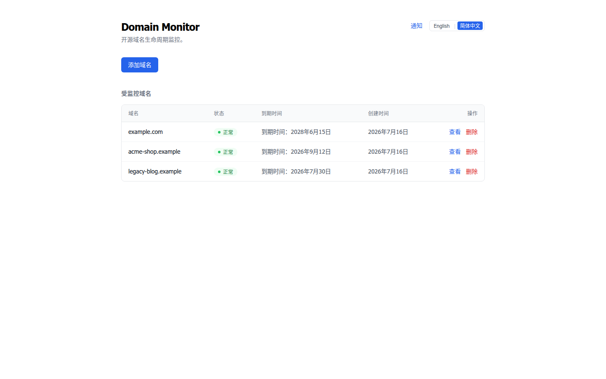
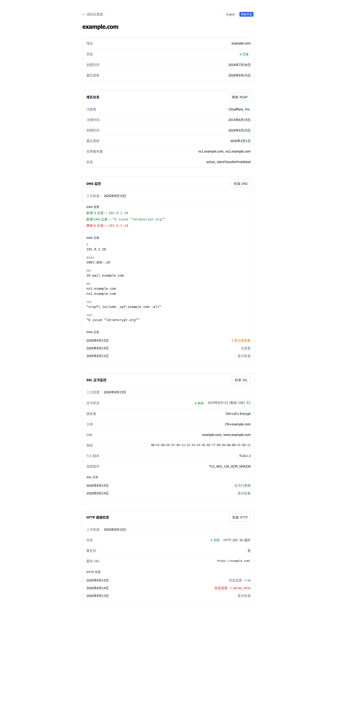
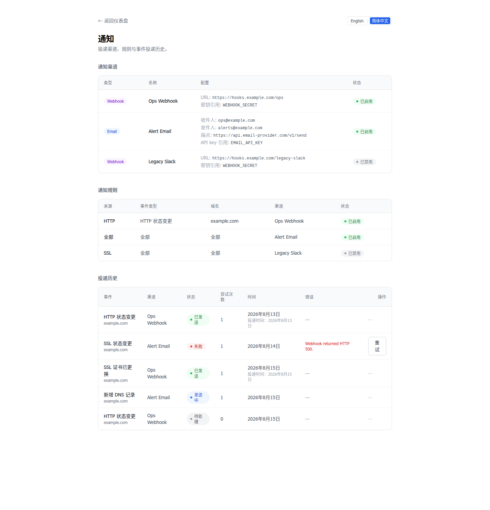

# Domain Monitor

[English](README.md) | [简体中文](README.zh-CN.md)

**自托管域名监控：RDAP、DNS、SSL 与 HTTP。**

[](https://github.com/hxx0611/Domain-Monitor/actions/workflows/ci.yml)
[](LICENSE)
[](https://github.com/hxx0611/Domain-Monitor/releases)

掌控你的域名：跟踪注册信息、发现 DNS 与 SSL 变化、捕获 HTTP 故障——并在变化发生时收到通知。

- **事件驱动通知** —— 变化转化为事件，事件转化为通知
- **Telegram / Webhook / Email** 投递到你的工具
- **Delivery Worker** —— 一次性 CLI，配合 cron 调度，无 daemon
- **管理员认证** —— 初始化向导、登录、一次性恢复码
- **English / 简体中文** 界面



> 截图反映较早版本；当前 UI 已加入管理员认证与 Telegram 渠道。

## 为什么选择 Domain-Monitor？

域名绝不只是"在线 / 离线"两种状态。真正值得关注的是中间的变化：

- **DNS 变化** —— 记录新增、移除或变更（A / AAAA / CNAME / MX / NS / TXT / CAA）
- **SSL 变化** —— 证书到期、替换，或与主机名不匹配
- **HTTP 故障 / 恢复** —— 宕机、状态变化、重定向漂移
- **注册信息** —— 注册商、到期时间、名称服务器、RDAP 状态

Domain Monitor 将这些变化转化为 **events**，按你的 **规则** 匹配，并以 **通知** 的形式投递——让你在事情*发生变化*时就知道，而不是等它出问题。

## 快速开始

```bash
git clone https://github.com/hxx0611/Domain-Monitor.git
cd Domain-Monitor
pnpm install
cp .env.example .env
pnpm dev
```

打开 [http://localhost:3000](http://localhost:3000)。

需要 **Node.js 22 LTS 或更新版本**（推荐 22 LTS；24 / 26 已纳入 CI 兼容性测试）与 [pnpm](https://pnpm.io/)。支持 Linux、macOS 与 Windows。better-sqlite3 随包携带预编译二进制，直接 `pnpm install` 即可，无需 Python 或 C++ 构建工具链。

## 功能

### Domain Intelligence

- 集中管理所有被监控域名 —— 自托管本地存储（SQLite）
- 域名创建时自动执行 RDAP 查询：注册商、到期时间、名称服务器、RDAP 状态（IANA bootstrap，590+ TLD）
- **ownership 感知的 RDAP fallback**：当子域名没有独立 RDAP object 时，查询会回退到注册域并报告 `ownership = parent` —— 父域的到期时间/注册商/名称服务器**绝不**写入子域名自身字段，UI 对子域名的注册信息显示 `Unavailable`
- 域名规范化与校验（接受 `https://example.com/path`，存储为 `example.com`）
- 随时手动刷新 RDAP

### DNS 监控

- 基于 DNS-over-HTTPS 的监控（Cloudflare DoH，可通过 `DNS_DOH_ENDPOINT` 更换解析器）
- 跟踪 A / AAAA / CNAME / MX / NS / TXT / CAA 记录
- 历史快照与新增 / 移除记录检测（仅 TTL 变化被忽略）
- 原子化失败检查处理 —— 部分失败绝不会删除旧数据

### SSL 证书监控

- TLS 证书检查（Node.js 原生 TLS）
- 到期跟踪：有效 / 即将到期 / 已过期
- 主机名不匹配检测（SAN 与查询域名对比）
- 证书指纹 / 替换检测，TLS 版本与加密套件信息

### HTTP 健康检查

- HTTP 状态分类与响应时间跟踪
- 重定向跟踪（次数与最终 URL）
- 连接失败检测（down）
- 每次检查的历史记录

### 通知系统

- DNS / SSL / HTTP 检查产生的域名生命周期事件
- 通知渠道：**Telegram**、**Email API** 与 **Webhook**
- 基于规则的投递匹配（全局或按域名规则，可按 source / event type 过滤）
- 通知配置 UI —— 渠道 CRUD（创建 / 编辑 / 启停 / 删除）、规则 CRUD
- Telegram Bot Token 通过 `getMe` 服务端验证，并以 **AES-256-GCM 加密存储**（`ENCRYPTION_KEY`），保留 legacy `TELEGRAM_BOT_TOKEN` 环境变量回退
- 投递历史与状态跟踪（pending / sending / sent / failed），支持手动重试

### 管理员认证

- 一次性 **初始化向导**（`/setup`）—— 创建管理员密码（scrypt 哈希）与一次性**恢复码**
- **HMAC 签名会话 cookie** —— 登录 / 登出、受保护的页面与 Server Actions
- 密码恢复会轮换会话密钥，使所有旧会话失效

### 投递 Worker

- 一次性 CLI（`pnpm worker`）—— 配合 cron 调度，无 daemon、无 HTTP endpoint
- **检查事务内自动生成 Event → Delivery**（原子操作）
- 过期 `sending` 恢复（崩溃安全）与并发 Worker 安全（SQLite CAS）

### 双语 UI

- Header 支持 **English / 简体中文** 语言切换
- 语言感知的 UI 字典；偏好存储在 `domain-monitor-locale` cookie 中（`en` / `zh-CN`，默认 `en`）
- Cookie + Server Action + `router.refresh()` —— 无 URL 前缀、无 middleware、无第三方 i18n 依赖
- 机器值（投递状态、事件类型、来源）绝不翻译

## 工作原理


一次检查在**同一个事务**中写入其快照、事件与匹配的 pending 投递。投递 Worker 原子 claim pending 投递（CAS）并调用发送器。从 UI 重试失败的投递可端到端工作。



## 安全设计

- **管理员认证** —— 受保护的页面与 Server Actions；scrypt 密码哈希；签名会话 cookie；恢复码轮换使旧会话失效
- **加密密钥存储** —— Telegram Bot Token 以 **AES-256-GCM 加密存储**（`iv:tag:ciphertext`，密钥来自 `ENCRYPTION_KEY`）；token 绝不渲染回 HTML/RSC/客户端 bundle —— 仅暴露 CONFIGURED/NOT CONFIGURED 状态
- **SSRF 防护** —— 出站请求仅 HTTPS，逐跳重定向复查
- **仅 HTTPS** 出站流量，**每一跳都重新校验重定向**
- **密钥隔离** —— API key / webhook secret / bot token 绝不暴露在 UI、Worker 输出或客户端 bundle 中
- **at-least-once** 投递，配合稳定的 `eventId` + `deliveryId` 供接收方去重

## 为可靠性而构建

- **708 个测试**（46 个文件），覆盖服务、状态机、发送器、投递 Worker、i18n 核心与管理员认证
- **SSRF 防护**的 webhook 与 email 发送器
- **SQLite 并发经过测试** —— 原子 claim（CAS）+ `busy_timeout = 5000`
- **自托管** —— 数据留在你自己的机器上

## 当前状态

**当前版本：v0.8.1 — RDAP Ownership 与到期信息修复**

当前支持：

- 域名管理
- RDAP 信息
- DNS 监控
- SSL 证书监控
- HTTP 健康检查
- 通知系统（telegram / email / webhook 渠道、规则、投递历史、手动重试）
- 通知配置 UI（渠道与规则 CRUD、Telegram token 设置与 `getMe` 验证）
- 投递 Worker（自动 Event → Delivery → Send 管道，一次性 CLI + 外部 cron）
- 管理员认证（初始化向导、登录/登出、恢复码、受保护页面）
- 加密密钥存储（AES-256-GCM、`ENCRYPTION_KEY`、legacy 环境变量回退）
- 双语 UI（English / 简体中文，基于 cookie 的语言切换）

DNS、SSL 与 HTTP 检查目前均为手动触发；自动调度计划在未来的版本中提供。

通知管道已完全闭环：一次检查在**同一个事务**中写入其快照、事件与匹配的 pending 投递；投递 Worker 消费这些 pending 投递并调用发送器。从 UI 重试失败的投递可端到端工作。

## 通知 Worker（V0.7）



投递 Worker 是一个**一次性 CLI 进程**，消费通知管道记录的 `pending` 投递。它是在自托管部署上运行通知的推荐方式。

### 运行方式

```bash
pnpm worker             # 一个 tick，最多 50 个 pending 投递
pnpm worker --limit 10  # 将本次 tick 限制为 10 个投递
pnpm worker --limit=10  # 同上
```

Worker **运行一个 tick 后退出** —— 它从不常驻内存、不启动任何 interval、不开放 HTTP endpoint、不保留后台定时器。它向 stdout 打印一行 JSON 摘要（exit 0），或向 stderr 打印清晰的错误（参数错误或未捕获异常时 exit 1）。

摘要格式（稳定）：

```json
{ "recovered": 0, "attempted": 0, "sent": 0, "failed": 0, "skipped": 0 }
```

- `recovered` — 被移回 `pending` 的过期 `sending` 投递（崩溃恢复）
- `attempted` — 本次 tick 尝试投递的数量
- `sent` / `failed` / `skipped` — 结果（`skipped` = 并发 Worker 先 claim 了它）

Worker 从不打印密钥：不打印 API key、不打印 `Authorization`/`Bearer` 值、不打印渠道配置 JSON、不打印 endpoint 查询字符串。

### 使用 cron 调度

推荐：CLI Worker 加外部调度器（系统 cron 或等效方案）。crontab 示例条目 —— 请按你的部署调整路径：

```cron
* * * * * cd /path/to/Domain-Monitor && pnpm worker >> /var/log/domain-monitor-worker.log 2>&1
```

- 每分钟运行一次；每次运行都是全新的一次性进程。
- 空队列立即退出。
- 默认上限：每个 tick 最多 50 个 pending 投递。
- **不新增任何公网 HTTP endpoint** —— 调度完全保持外部化（无 webhook 调度 endpoint、无 serverless cron）。
- 重叠的 cron 实例是安全的：SQLite CAS 保证同一投递只会被一个 Worker claim。建议保持每分钟一次，避免额外的数据库争用。

### 运行时语义

- **Check → Event** — 由 V0.6 管道记录（每次检查一个事务，已去重）。
- **Event → Delivery** — 自 V0.7 起自动：检查事务为每个新记录的事件创建匹配的 pending 投递（按规则匹配、按渠道去重）。重复事件（相同 dedup key）绝不会重新生成投递。
- **Delivery → Send** — Worker 原子 claim `pending` 投递（CAS）并调用现有发送器。
- **failed** — Worker **不会**自动重试失败的投递；无 backoff、无 max-attempts。
- **retry** — 仅显式操作：`retryDelivery()` / 通知 UI。
- **过期 sending** — Worker 在每个 tick 开始时运行 `recoverStaleSending()`；默认过期阈值为 **5 分钟**。
- **至少一次投递（at-least-once）** — 发送中途崩溃会留下 `sending`，下个 tick 会恢复并再次发送，因此同一投递可能被发送多次。接收方必须使用 payload 中稳定的 `eventId` + `deliveryId` 去重。这是 at-least-once，**不是** exactly-once。
- **历史事件** — V0.7 不会为升级前记录的事件回溯生成投递；Worker 只消费当前的 `pending` 队列。
- SQLite `busy_timeout = 5000` 已启用，Worker 与 Web 应用可并发写入而不会立即出现 `SQLITE_BUSY` 失败。
- 无 daemon、无自动重试、无 backoff、无 max-attempts、无分布式队列（Redis/Kafka）、无 HTTP 调度 endpoint、无 serverless 调度器、无 SLA/可用性监控。

## 测试

```bash
pnpm test
```

当前测试套件：**708 个测试（46 个文件）**，覆盖域名校验、RDAP 解析与 fallback ownership 语义、DNS 规范化与 diff、SSL 证书解析与 diff、HTTP 状态分类与 SSRF 防护抓取、DNS/SSL/HTTP 服务、通知事件/规则/投递状态机、SSRF 防护的 webhook 与 email 发送器、自动 Event → Delivery 生成、投递 Worker、管理员认证（会话、setup/login/recovery）、加密密钥存储、Telegram 发送器密钥解析、语言感知的 i18n 核心（字典、cookie 回退、客户端/服务端边界）与数据仓库。

推送改动前还需运行：

```bash
pnpm lint
pnpm format:check
pnpm build
```

## 架构

```
UI (Next.js App Router)
        ↓
Server Actions
        ↓
Domain / RDAP / DNS services
        ↓
Repository
        ↓
SQLite
```

- **Next.js App Router** + Server Actions
- **Drizzle ORM** + **SQLite**（migrations 位于 `src/db/migrations/`）
- **Cloudflare DoH** 用于 DNS 查询（可通过 `DNS_DOH_ENDPOINT` 更换解析器）
- **IANA RDAP bootstrap** 用于注册信息

详细开发说明见 [docs/development.md](docs/development.md)。

## 数据库

通过 Drizzle ORM 使用 SQLite。使用内置命令管理 schema：

```bash
pnpm db:generate   # 生成 migration 文件
pnpm db:migrate    # 运行 migrations
pnpm db:studio     # 打开可视化数据库浏览器
```

## Roadmap

- [x] **V0.1** — 域名管理
- [x] **V0.2** — RDAP / WHOIS 集成
- [x] **V0.3** — DNS 监控
- [x] **V0.4** — SSL 证书监控
- [x] **V0.5** — HTTP 健康检查
- [x] **V0.6** — 通知系统
- [x] **V0.7** — 通知投递 Worker
- [x] **V0.7.1** — 双语 UI
- [x] **V0.7.3** — 监控错误分类
- [x] **V0.8.0** — 管理员认证、Telegram 通知与加密密钥存储
- [x] **V0.8.1** — RDAP Ownership 与到期信息修复（bugfix 版本）

## 参与贡献

欢迎贡献。

```bash
pnpm install
pnpm test
pnpm lint
pnpm build
```

完整贡献指南见 [CONTRIBUTING.md](CONTRIBUTING.md)。

## 许可证

[MIT](LICENSE)
