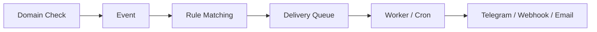

# Domain Monitor

[English](README.md) | [简体中文](README.zh-CN.md)

**自托管域名监控：RDAP、DNS、SSL 与 HTTP。**

[](https://github.com/hxx0611/Domain-Monitor/actions/workflows/ci.yml)
[](LICENSE)
[](https://github.com/hxx0611/Domain-Monitor/releases)

掌控你的域名：跟踪注册信息、发现 DNS 与 SSL 变化、捕获 HTTP 故障——并在变化发生时收到通知。

- **事件驱动通知** —— 变化转化为事件，事件转化为通知
- **Telegram / Webhook / Email** 投递到你的工具
- **手动到期与提醒** —— 手动设置到期时间（RDAP 或 manual 来源）、登记平台，并安排到期提醒
- **Delivery Worker** —— 一次性 CLI，配合 cron 调度，无 daemon
- **管理员认证** —— 初始化向导、登录、一次性恢复码
- **English / 简体中文** 界面


> 截图反映较早版本；当前 UI 已加入管理员认证与 Telegram 渠道。

## 为什么选择 Domain-Monitor？

域名绝不只是"在线 / 离线"两种状态。真正值得关注的是中间的变化：

- **DNS 变化** —— 记录新增、移除或变更（A / AAAA / CNAME / MX / NS / TXT / CAA）
- **SSL 变化** —— 证书到期、替换，或与主机名不匹配
- **HTTP 故障 / 恢复** —— 宕机、状态变化、重定向漂移
- **注册信息** —— 注册商、到期时间、名称服务器、RDAP 状态

Domain Monitor 将这些变化转化为 **events**，按你的 **规则** 匹配，并以 **通知** 的形式投递——让你在事情*发生变化*时就知道，而不是等它出问题。

## 快速开始

```bash
git clone https://github.com/hxx0611/Domain-Monitor.git
cd Domain-Monitor
pnpm install
cp .env.example .env
pnpm dev
```

打开 [http://localhost:3000](http://localhost:3000)。

需要 **Node.js 22 LTS 或更新版本**（推荐 22 LTS；24 / 26 已纳入 CI 兼容性测试）与 [pnpm](https://pnpm.io/)。支持 Linux、macOS 与 Windows。better-sqlite3 随包携带预编译二进制，直接 `pnpm install` 即可，无需 Python 或 C++ 构建工具链。

> **有两种运行方式，请先选择一种，不要把两套命令混着执行：**
>
> - **Option A — 本地 / Node**（上面就是）：`better-sqlite3` + SQLite，`pnpm dev` / `pnpm build` / `pnpm start`，数据库在本地文件 `data/domain-monitor.db`。
> - **Option B — Cloudflare Production**（下面整节）：Cloudflare Worker + OpenNext + D1，`custom-worker.ts` + `scheduled()`，数据库在云端 D1。**如果目标是部署到 Cloudflare，请继续往下读，不要使用上面的本地命令。**

---

## Cloudflare Production 部署（Option B）

> 本节面向**第一次接触 Cloudflare Workers / D1 / OpenNext 的新手**。按顺序执行即可，不要跳过任何一步。
> 完成后你会得到一套**完全属于你自己的** Cloudflare 部署（自己的 Worker、自己的 D1、自己的域名），不会碰任何人的生产资源。

> 🚨🚨🚨 **动手前必读（安全警告）** 🚨🚨🚨
>
> 1. **不要直接使用仓库 `wrangler.prod.jsonc` 里的 `database_id`**。那是**作者生产环境的数据库 ID**，在你的账号里根本不存在；部署时会失败，若在作者账号上操作甚至可能影响作者的生产数据。**你必须创建自己的 D1，并把 `database_id` 替换成你自己的**（见第 3 步）。
> 2. **如果你的 Cloudflare 账号里已经存在名为 `domain-monitor` 的 Worker 或 D1**（例如你之前部署过），`wrangler d1 create domain-monitor` 会冲突，`wrangler deploy` 甚至会**覆盖你已有的同名 Worker**。请改用唯一名称，例如 `domain-monitor-yourname`，并保证 Worker 名、D1 名、`wrangler.prod.jsonc` 中的 `name`/`database_name` 和后续所有命令**使用同一个名称**。
> 3. **不要对不属于你的 Worker 执行 `wrangler secret put`、`wrangler deploy` 或其他任何修改操作**。执行前先确认当前 Cloudflare 账号是你自己的。

### 0. 前置条件

- 一个 [Cloudflare](https://dash.cloudflare.com/) 账号（免费即可）
- 一个域名（可选但推荐；没有也能用 `*.workers.dev` 临时域名验证）
- Node.js 22+ 与 pnpm（同上）
- 一台能跑 `bash` 的机器；Windows 用户请见第 7 节的 PowerShell 构建命令

### 1. 克隆并安装依赖

```bash
git clone https://github.com/hxx0611/Domain-Monitor.git
cd Domain-Monitor
pnpm install
```

Wrangler（Cloudflare 官方 CLI）与 OpenNext Cloudflare 适配器**不是项目的正式依赖**，需要单独安装为开发依赖：

```bash
pnpm add -D wrangler @opennextjs/cloudflare
```

> ⚠️ **pnpm 11 需要放行 workerd 的构建脚本**：wrangler 依赖 `workerd`，pnpm 11 出于安全默认拦截依赖的 postinstall 脚本，安装时可能提示 `ERR_PNPM_IGNORED_BUILDS: Ignored build scripts: workerd`。不放行的话，后续 OpenNext build 会失败。
>
> **推荐方法（最简单，不会改坏文件）：运行**
>
> ```bash
> pnpm approve-builds
> ```
>
> 在交互提示中选择 `workerd` 并允许，然后重跑 `pnpm install`。
>
> **备选方法（手动编辑 `pnpm-workspace.yaml`）**：
>
> 1. 打开 `pnpm-workspace.yaml`，查看是否已有 pnpm 自动生成的占位行（例如 `workerd: set this to true or false`）；
> 2. **如果已有 `workerd` 的条目：直接把它的值改成 `workerd: true`，绝对不要再新增第二行**；
> 3. **如果没有 `workerd` 条目：在 `allowBuilds:` 下**追加一行 `workerd: true`（注意缩进与已有条目一致）。
>
> ⚠️ **不要**在同一个 YAML 文件里重复添加 `allowBuilds:` 或 `workerd:`——重复 key 会导致 `pnpm install` 报 `duplicated mapping key` 错误。编辑后重跑一次 `pnpm install` 确认不再报错。

验证：

```bash
pnpm exec wrangler --version          # 应输出 4.x
pnpm exec opennextjs-cloudflare --help  # 应打印帮助信息
```

### 2. 创建 Cloudflare API Token

在 Cloudflare Dashboard → **My Profile → API Tokens → Create Token**，使用模板 **“Edit Cloudflare Workers”**（若模板不存在则自定义），至少需要以下权限（全部设为 **Edit**）：

| 资源 | 权限 | 用途 |
|---|---|---|
| Account → Workers Scripts | Edit | 上传/更新 Worker |
| Account → D1 | Edit | 创建/管理 D1 数据库 |
| Zone → Workers Routes（可选） | Edit | 绑定自定义域名 |
| Zone → Zone（可选） | Read | 读取你的域名区域 |

创建后把 Token 导出为环境变量（**不要写进仓库、`.env`、`wrangler.prod.jsonc` 或任何配置文件**）：

```bash
export CLOUDFLARE_API_TOKEN=你的token
export CLOUDFLARE_ACCOUNT_ID=你的账号id   # 从 Dashboard 右下角获取
```

（或使用 `wrangler login` 浏览器登录，二选一。）

### 3. 创建你自己的 D1 数据库 ⚠️ 最重要

> ⚠️ **如果你的账号里已存在名为 `domain-monitor` 的 D1 或 Worker，请改用唯一名称**，例如 `domain-monitor-yourname`（把 `yourname` 换成你自己的标识）。**千万不要覆盖不属于你的资源。** 下文所有命令中的 `domain-monitor` 都要相应替换成你的唯一名称。

```bash
pnpm exec wrangler d1 create domain-monitor
```

输出类似：

```
✅ Successfully created DB 'domain-monitor' in region APAC
Created your new D1 database.
[[d1_databases]]
binding = "DB"
database_name = "domain-monitor"
database_id = "<YOUR_DATABASE_ID>"
```

> ⚠️ **绝对不要使用仓库 `wrangler.prod.jsonc` 里已有的 `database_id`**（那是作者生产环境的数据库，你的账号里根本不存在它，直接部署会失败；更糟的是，如果你复制了它并在作者账号上操作，可能影响作者生产数据）。**必须把上面输出里的 `<YOUR_DATABASE_ID>` 记下来**。

打开 `wrangler.prod.jsonc`，把 `d1_databases[0].database_id` 替换成你自己的 `<YOUR_DATABASE_ID>`（保持 `binding = "DB"` 不变）。**如果你使用了唯一名称**（如 `domain-monitor-yourname`），同时把 `d1_databases[0].database_name` 和顶部的 `"name"` 都改成同一个名称——**Worker 名、D1 名、配置文件与后续所有命令必须保持一致**。

### 4. 执行 D1 migrations

> 以下命令**必须在仓库根目录**（`cd Domain-Monitor` 之后的位置）执行，并**必须带上 `--config wrangler.prod.jsonc`**——仓库根目录没有默认的 `wrangler.jsonc`，不带 `--config` 会报 `No configuration file found`。

```bash
pnpm exec wrangler d1 migrations apply domain-monitor --remote --config wrangler.prod.jsonc
```

- 这是把 `src/db/migrations/` 下的 migration 应用到你**刚刚创建、属于你自己的** D1 数据库（`--remote` 表示云端）。
- 完成后应看到 0000–0007 全部 applied。
- ⚠️ **`pnpm db:migrate` 是本地 SQLite migration，不能替代这一步**；它不会碰 Cloudflare D1。

### 5. 设置 Secrets（ENCRYPTION_KEY / SESSION_SECRET）

- `ENCRYPTION_KEY`：用于加密 Telegram token 等敏感数据（AES-256-GCM）。**一旦设置，丢失后已加密的数据将无法恢复**。
- `SESSION_SECRET`：用于登录会话（cookie）签名。

> 在仓库根目录执行，并**必须带 `--config wrangler.prod.jsonc`**，确保 secret 写入**你自己**的 Worker（即第 3 步里改好名字的那个）。

```bash
openssl rand -hex 32 | pnpm exec wrangler secret put ENCRYPTION_KEY --config wrangler.prod.jsonc
openssl rand -hex 32 | pnpm exec wrangler secret put SESSION_SECRET --config wrangler.prod.jsonc
```

> ⚠️ **绝不要对不属于你的 Worker 执行 `wrangler secret put`**——它会把 secret 写入该 Worker 并覆盖已有值。执行前确认 `wrangler.prod.jsonc` 里的 `"name"` 是你自己的 Worker 名。

Windows PowerShell 没有自带 `openssl` 时，先生成 64 位 hex 再手动粘贴：

```powershell
-join ([System.Security.Cryptography.RandomNumberGenerator]::GetBytes(32) | ForEach-Object { $_.ToString("x2") })
```

> 每个命令会提示输入 secret；直接粘贴上面生成的 64 位 hex 即可。这些值**不会写入 git、不会写入 README、不会写入 `.env`、不会写入任何配置文件**，只存在 Cloudflare Secrets 里。

### 6. 清理旧 build 缓存

**每次 Cloudflare 构建前**都执行（重要原因见第 8 节）：

```bash
rm -rf .next .open-next
```

Windows PowerShell：

```powershell
Remove-Item -Recurse -Force .next,.open-next
```

### 7. 构建 OpenNext（Cloudflare）产物

```bash
OPENNEXT_CLOUDFLARE=1 SKIP_WRANGLER_CONFIG_CHECK=yes pnpm exec opennextjs-cloudflare build
```

Windows PowerShell（同样的构建命令，环境变量用 `$env:` 设置）：

```powershell
$env:OPENNEXT_CLOUDFLARE="1"
$env:SKIP_WRANGLER_CONFIG_CHECK="yes"
pnpm exec opennextjs-cloudflare build
Remove-Item Env:OPENNEXT_CLOUDFLARE,Env:SKIP_WRANGLER_CONFIG_CHECK
```

- **`OPENNEXT_CLOUDFLARE=1` 不是可选项**：它让 Next.js 使用 `tsconfig.cf.json` 的 stub 别名（把 `@/db` 指向 Cloudflare stub），并让 webpack 把 `@/db` / `@/db/node-singleton` 重定向到 stub，从而保证 **better-sqlite3 等 Node/SQLite 依赖不会进入 Cloudflare Worker bundle**。不设置它，构建产物会混入 Node/SQLite 运行时，部署到 Worker 后直接报错。
- `SKIP_WRANGLER_CONFIG_CHECK=yes`：仓库根目录只有 `wrangler.prod.jsonc`（OpenNext 默认只认根目录的 `wrangler.jsonc`/`wrangler.toml`），所以跳过它自己的配置存在性检查。**这不会影响 `wrangler deploy`**（deploy 会显式 `--config wrangler.prod.jsonc`）。
- 成功标志：`.open-next/worker.js` 与 `.open-next/assets/`（含 `BUILD_ID`）存在。

> 为什么必须先清缓存：如果之前跑过不带 `OPENNEXT_CLOUDFLARE=1` 的普通 `pnpm build`，`.next` 缓存可能残留 Node/SQLite 路径的构建结果；直接复用会导致 Cloudflare 产物里混入错误代码。**先删 `.next .open-next` 再构建**是廉价且可靠的保险。

### 8. dry-run / bundle 安全验证（推荐）

```bash
pnpm exec wrangler deploy --config wrangler.prod.jsonc --dry-run
```

- 成功标志：输出 `Read N files from the assets directory .open-next/assets`、`env.DB` / `env.ASSETS` bindings、`--dry-run: exiting now`。
- 进阶验证（可选）：把最终 bundle 导出后确认没有 SQLite 运行时：

```bash
pnpm exec wrangler deploy --config wrangler.prod.jsonc --dry-run --outdir /tmp/dm-bundle
grep -c "new Database(" /tmp/dm-bundle/custom-worker.js   # 期望 0
grep -c "better-sqlite3" /tmp/dm-bundle/custom-worker.js  # 只允许出现在 drizzle-orm 的包名路径里
```

> Cloudflare 部署使用 **D1**，而不是 better-sqlite3/SQLite。构建产物里不应包含 `new Database(` / `DATABASE_URL` / `node:sqlite` 的运行时引用。

### 9. 部署 Worker

```bash
pnpm exec wrangler deploy --config wrangler.prod.jsonc
```

- 顺序不能反：**必须先完成第 7 步构建**（生成 `.open-next/assets`），再 deploy；否则 `assets.directory .open-next/assets does not exist` 直接失败。
- 输出会显示 `Uploaded domain-monitor` / `Deployed domain-monitor`，并给出版本号。
- ⚠️ **部署前最后确认**：`wrangler.prod.jsonc` 顶部的 `"name"` 必须是**你自己的 Worker 名**（默认 `domain-monitor`，若你用了唯一名称则为 `domain-monitor-yourname`）。`wrangler deploy` 会**上传/覆盖**这个名字对应的 Worker——**绝不要**覆盖别人的同名 Worker。

### 10. Cron 定时触发

`wrangler.prod.jsonc` 已内置：

```jsonc
"triggers": { "crons": ["0 * * * *"] }   // 每小时整点
```

- 部署后 Cron **自动由 Cloudflare 管理**，不需要配 Linux cron。
- Cloudflare production 的定时入口是 Worker 的 `scheduled()`（经 D1 调用 `runOnce`），**≠** 本地 `pnpm worker`。

### 11. 绑定域名

- **先验证**：`https://domain-monitor.<你的workers子域>.workers.dev` 应能打开（账号默认分配；若你用了唯一名称，地址相应为 `https://domain-monitor-yourname.<你的workers子域>.workers.dev`）。
- **再绑定自定义域名**（可选，推荐）：在 Dashboard → Workers & Pages → 你的 Worker → **Settings → Domains & Routes → Add → Custom Domain**，输入 `monitor.<你的域名>` 并确认 DNS 自动配置。

- ⚠️ **不要照抄作者域名**（`monitor.snooze.eu.cc` 之类），请使用你自己的域名。

### 12. 第一次访问初始化（/setup）

打开 `https://monitor.<你的域名>`（或 workers.dev 地址）：

1. 未初始化时自动跳转 `/setup` → 创建管理员账号
2. **保存 recovery code**（重置密码的唯一凭据，仅显示一次）
3. 登录
4. **Notifications → 添加 Telegram channel**：填入 Bot Token，系统会调用 Telegram `getMe` 验证，通过后以 AES-256-GCM 加密存储
5. **Telegram Bot Token 不需要放进 `.env`**，它只存在于你的 D1 数据库（加密后）

### 13. 部署成功 Checklist

- [ ] Git clone 完成
- [ ] `pnpm install` 完成
- [ ] `pnpm exec wrangler --version` 可用
- [ ] `pnpm exec opennextjs-cloudflare --help` 可用
- [ ] 自己的 D1 已创建
- [ ] `wrangler.prod.jsonc` 中 `database_id` 已是**你自己的** `<YOUR_DATABASE_ID>`
- [ ] `wrangler d1 migrations apply --remote --config wrangler.prod.jsonc` 成功（0000–0007）
- [ ] `ENCRYPTION_KEY` 已配置（`wrangler secret put`）
- [ ] `SESSION_SECRET` 已配置（`wrangler secret put`）
- [ ] `.next` / `.open-next` 已清理
- [ ] `OPENNEXT_CLOUDFLARE=1` 构建成功
- [ ] `.open-next/worker.js` 存在
- [ ] `.open-next/assets/` 存在
- [ ] `wrangler deploy --dry-run` 成功
- [ ] Worker 已部署
- [ ] Cron 已配置（`0 * * * *`，Cloudflare 托管）
- [ ] 自定义域名可访问（或 workers.dev 可访问）
- [ ] `/setup` 可访问
- [ ] 管理员已创建
- [ ] Recovery code 已保存
- [ ] Telegram channel 已验证

---

[回到顶部](#domain-monitor)

## 功能

### Domain Intelligence

- 集中管理所有被监控域名 —— 自托管本地存储（SQLite）
- 域名创建时自动执行 RDAP 查询：注册商、到期时间、名称服务器、RDAP 状态（IANA bootstrap，590+ TLD）
- **ownership 感知的 RDAP fallback**：当子域名没有独立 RDAP object 时，查询会回退到注册域并报告 `ownership = parent` —— 父域的到期时间/注册商/名称服务器**绝不**写入子域名自身字段，UI 对子域名的注册信息显示 `Unavailable`
- **手动到期**（来源 = `manual`）：手动设置注册日期、到期日期、登记平台与管理 URL —— 适用于 RDAP 数据不可靠、缺失或不符合展示需求的域名。手动日期**绝不会**被 RDAP 刷新覆盖（刷新只更新 RDAP 元数据，或对 `no-object` / parent 结果清空）
- **到期提醒**：按域名配置提醒规则（例如到期前 30 天）；通知 Worker 会评估并产生 `expiration_reminder` 事件（可用性说明见下方 **Delivery Worker**）
- 域名规范化与校验（接受 `https://example.com/path`，存储为 `example.com`）
- 随时手动刷新 RDAP

### DNS 监控

- 基于 DNS-over-HTTPS 的监控（Cloudflare DoH，可通过 `DNS_DOH_ENDPOINT` 更换解析器）
- 跟踪 A / AAAA / CNAME / MX / NS / TXT / CAA 记录
- 历史快照与新增 / 移除记录检测（仅 TTL 变化被忽略）
- 原子化失败检查处理 —— 部分失败绝不会删除旧数据

### SSL 证书监控

- TLS 证书检查（Node.js 原生 TLS）
- 到期跟踪：有效 / 即将到期 / 已过期
- 主机名不匹配检测（SAN 与查询域名对比）
- 证书指纹 / 替换检测，TLS 版本与加密套件信息

### HTTP 健康检查

- HTTP 状态分类与响应时间跟踪
- 重定向跟踪（次数与最终 URL）
- 连接失败检测（down）
- 每次检查的历史记录

### 通知系统

- DNS / SSL / HTTP 检查产生的域名生命周期事件
- 通知渠道：**Telegram**、**Email API** 与 **Webhook**
- 基于规则的投递匹配（全局或按域名规则，可按 source / event type 过滤）
- 通知配置 UI —— 渠道 CRUD（创建 / 编辑 / 启停 / 删除）、规则 CRUD
- Telegram Bot Token 通过 `getMe` 服务端验证，并以 **AES-256-GCM 加密存储**（`ENCRYPTION_KEY`），保留 legacy `TELEGRAM_BOT_TOKEN` 环境变量回退
- 投递历史与状态跟踪（pending / sending / sent / failed），支持手动重试

### 管理员认证

- 一次性 **初始化向导**（`/setup`）—— 创建管理员密码（scrypt 哈希）与一次性**恢复码**
- **HMAC 签名会话 cookie** —— 登录 / 登出、受保护的页面与 Server Actions
- 密码恢复会轮换会话密钥，使所有旧会话失效

### 投递 Worker

> **可用性说明（v0.8.3）：** Worker **已在生产环境启用** —— 每小时 watchdog（`scripts/worker-watchdog.sh`）以单实例方式运行，每小时执行一次 tick（`tsx --conditions=react-server scripts/worker.ts --limit 50`）。到期提醒的评估与投递已上线；真实通知发送只会在明确批准的 safety gate 中执行（本版本发布未执行任何真实 Telegram/Webhook/Email 发送）。

- 一次性 CLI（`pnpm worker`）—— 配合 cron 或内置 watchdog 调度，无 daemon、无 HTTP endpoint
- **检查事务内自动生成 Event → Delivery**（原子操作）
- **到期提醒**：`evaluateExpirationReminders()` 在 Worker tick 内运行，为到达提醒日的域名产生 `expiration_reminder` 事件（来源 `expiration`），按天去重，每个域名每天只提醒一次
- **Event → Delivery 一体生成**：`insertEventsAndGenerateDeliveries` 一步创建事件与投递；并发 tick 安全（SQLite CAS）—— 每个提醒每天至多一个 event、一个 delivery、一次 sender 调用
- 过期 `sending` 恢复（崩溃安全）与并发 Worker 安全（SQLite CAS）

### 双语 UI

- Header 支持 **English / 简体中文** 语言切换
- 语言感知的 UI 字典；偏好存储在 `domain-monitor-locale` cookie 中（`en` / `zh-CN`，默认 `en`）
- Cookie + Server Action + `router.refresh()` —— 无 URL 前缀、无 middleware、无第三方 i18n 依赖
- 机器值（投递状态、事件类型、来源）绝不翻译

## 工作原理



一次检查在**同一个事务**中写入其快照、事件与匹配的 pending 投递。投递 Worker 原子 claim pending 投递（CAS）并调用发送器。从 UI 重试失败的投递可端到端工作。


## 安全设计

- **管理员认证** —— 受保护的页面与 Server Actions；scrypt 密码哈希；签名会话 cookie；恢复码轮换使旧会话失效
- **加密密钥存储** —— Telegram Bot Token 以 **AES-256-GCM 加密存储**（`iv:tag:ciphertext`，密钥来自 `ENCRYPTION_KEY`）；token 绝不渲染回 HTML/RSC/客户端 bundle —— 仅暴露 CONFIGURED/NOT CONFIGURED 状态
- **SSRF 防护** —— 出站请求仅 HTTPS，逐跳重定向复查
- **仅 HTTPS** 出站流量，**每一跳都重新校验重定向**
- **密钥隔离** —— API key / webhook secret / bot token 绝不暴露在 UI、Worker 输出或客户端 bundle 中
- **at-least-once** 投递，配合稳定的 `eventId` + `deliveryId` 供接收方去重

## 为可靠性而构建

- **849 个测试**（57 个文件），覆盖服务、状态机、发送器、投递 Worker、手动到期与提醒、Worker 运行时修复（barrel 导入 + 投递生成）、i18n 核心、管理员认证、域名/DNS action 层与生产备份机制
- **780 个测试**（v0.8.4，53 个文件），新增受控测试通知 action 契约（授权、channel 校验、去重、单次发送限制、secret 泄漏防护）及其真实 DB 集成路径（加密 secret 链路、发送成功/失败、domain/rule 不变）
- **813 个测试**（v0.8.7），新增通知时区 IANA 校验 + `Intl` 渲染
- **849 个测试**（v0.8.8），新增域名/DNS action 覆盖（Phase 13B，36 个测试）
- **SSRF 防护**的 webhook 与 email 发送器
- **SQLite 并发经过测试** —— 原子 claim（CAS）+ `busy_timeout = 5000`
- **自托管** —— 数据留在你自己的机器上

## 当前状态

**当前版本：v0.8.9 — 文档与运维收尾**（v0.8.8 — 域名/DNS action 覆盖、通知时区、Windows CI 修复）

当前支持：

- 域名管理
- RDAP 信息
- **手动到期** —— 手动设置注册 / 到期日期、登记平台与管理 URL；手动日期在 RDAP 刷新后保持不变
- **到期提醒** —— 按域名配置提醒天数，由 Worker 评估为 `expiration_reminder` 事件
- DNS 监控
- SSL 证书监控
- HTTP 健康检查
- 通知系统（telegram / email / webhook 渠道、规则——含 `expiration_reminder`——投递历史、手动重试）
- 通知配置 UI（渠道与规则 CRUD、Telegram token 设置与 `getMe` 验证）
- 投递 Worker（自动 Event → Delivery → Send 管道；**生产环境已启用**，通过每小时 watchdog 运行——见上方可用性说明）
- 管理员认证（初始化向导、登录/登出、恢复码、受保护页面）
- 加密密钥存储（AES-256-GCM、`ENCRYPTION_KEY`、legacy 环境变量回退）
- 双语 UI（English / 简体中文，基于 cookie 的语言切换）

DNS、SSL 与 HTTP 检查目前均为手动触发；自动调度计划在未来的版本中提供。

通知管道已完全闭环：一次检查在**同一个事务**中写入其快照、事件与匹配的 pending 投递；投递 Worker 消费这些 pending 投递并调用发送器。从 UI 重试失败的投递可端到端工作。

## 通知 Worker（V0.7）


投递 Worker 是一个**一次性 CLI 进程**，消费通知管道记录的 `pending` 投递。它是在自托管部署上运行通知的推荐方式。

### 运行方式

```bash
pnpm worker             # 一个 tick，最多 50 个 pending 投递
pnpm worker --limit 10  # 将本次 tick 限制为 10 个投递
pnpm worker --limit=10  # 同上
```

Worker **运行一个 tick 后退出** —— 它从不常驻内存、不启动任何 interval、不开放 HTTP endpoint、不保留后台定时器。它向 stdout 打印一行 JSON 摘要（exit 0），或向 stderr 打印清晰的错误（参数错误或未捕获异常时 exit 1）。

摘要格式（稳定）：

```json
{ "recovered": 0, "attempted": 0, "sent": 0, "failed": 0, "skipped": 0 }
```

- `recovered` — 被移回 `pending` 的过期 `sending` 投递（崩溃恢复）
- `attempted` — 本次 tick 尝试投递的数量
- `sent` / `failed` / `skipped` — 结果（`skipped` = 并发 Worker 先 claim 了它）

Worker 从不打印密钥：不打印 API key、不打印 `Authorization`/`Bearer` 值、不打印渠道配置 JSON、不打印 endpoint 查询字符串。

### 使用 cron 调度

推荐：CLI Worker 加外部调度器（系统 cron 或等效方案）。crontab 示例条目 —— 请按你的部署调整路径：

```cron
* * * * * cd /path/to/Domain-Monitor && pnpm worker >> /var/log/domain-monitor-worker.log 2>&1
```

- 每分钟运行一次；每次运行都是全新的一次性进程。
- 空队列立即退出。
- 默认上限：每个 tick 最多 50 个 pending 投递。
- **不新增任何公网 HTTP endpoint** —— 调度完全保持外部化（无 webhook 调度 endpoint、无 serverless cron）。
- 重叠的 cron 实例是安全的：SQLite CAS 保证同一投递只会被一个 Worker claim。建议保持每分钟一次，避免额外的数据库争用。

### 运行时语义

- **Check → Event** — 由 V0.6 管道记录（每次检查一个事务，已去重）。
- **Event → Delivery** — 自 V0.7 起自动：检查事务为每个新记录的事件创建匹配的 pending 投递（按规则匹配、按渠道去重）。重复事件（相同 dedup key）绝不会重新生成投递。
- **Delivery → Send** — Worker 原子 claim `pending` 投递（CAS）并调用现有发送器。
- **failed** — Worker **不会**自动重试失败的投递；无 backoff、无 max-attempts。
- **retry** — 仅显式操作：`retryDelivery()` / 通知 UI。
- **过期 sending** — Worker 在每个 tick 开始时运行 `recoverStaleSending()`；默认过期阈值为 **5 分钟**。
- **至少一次投递（at-least-once）** — 发送中途崩溃会留下 `sending`，下个 tick 会恢复并再次发送，因此同一投递可能被发送多次。接收方必须使用 payload 中稳定的 `eventId` + `deliveryId` 去重。这是 at-least-once，**不是** exactly-once。
- **历史事件** — V0.7 不会为升级前记录的事件回溯生成投递；Worker 只消费当前的 `pending` 队列。
- SQLite `busy_timeout = 5000` 已启用，Worker 与 Web 应用可并发写入而不会立即出现 `SQLITE_BUSY` 失败。
- 无 daemon、无自动重试、无 backoff、无 max-attempts、无分布式队列（Redis/Kafka）、无 HTTP 调度 endpoint、无 serverless 调度器、无 SLA/可用性监控。

## 测试

```bash
pnpm test
```

当前测试套件：**813 个测试（55 个文件）**，覆盖域名校验（含手动到期字段与提醒天数规范化）、RDAP 解析与 fallback ownership 语义、登记平台校验、DNS 规范化与 diff、SSL 证书解析与 diff、HTTP 状态分类与 SSRF 防护抓取、DNS/SSL/HTTP 服务、通知事件/规则/投递状态机（含 `expiration_reminder` 事件类型）、SSRF 防护的 webhook 与 email 发送器、自动 Event → Delivery 生成、到期提醒评估、投递 Worker（含并发 tick 去重 / CAS E2E）、受控测试通知 action（授权、channel 校验、去重、单次发送限制、secret 泄漏防护）、管理员认证（会话、setup/login/recovery）、加密密钥存储、Telegram 发送器密钥解析、语言感知的 i18n 核心（字典、cookie 回退、客户端/服务端边界）、通知时区（IANA 校验与 `Intl` 渲染）与数据仓库。

推送改动前还需运行：

```bash
pnpm lint
pnpm format:check
pnpm build
```

## 架构

```
UI (Next.js App Router)
        ↓
Server Actions
        ↓
Domain / RDAP / DNS services
        ↓
Repository
        ↓
SQLite
```

- **Next.js App Router** + Server Actions
- **Drizzle ORM** + **SQLite**（migrations 位于 `src/db/migrations/`）
- **Cloudflare DoH** 用于 DNS 查询（可通过 `DNS_DOH_ENDPOINT` 更换解析器）
- **IANA RDAP bootstrap** 用于注册信息

详细开发说明见 [docs/development.md](docs/development.md)。

## 数据库

本地/Node（Option A）通过 Drizzle ORM 使用 SQLite。使用内置命令管理本地 schema：

```bash
pnpm db:generate   # 生成 migration 文件
pnpm db:migrate    # 运行 migrations（仅本地 SQLite）
pnpm db:studio     # 打开可视化数据库浏览器
```

> ⚠️ **`pnpm db:migrate` 只作用于本地 SQLite 文件（`data/domain-monitor.db`），与 Cloudflare D1 无关。** 生产部署（Option B）的数据库是 Cloudflare D1，迁移命令是：
>
> ```bash
> pnpm exec wrangler d1 migrations apply domain-monitor --remote --config wrangler.prod.jsonc
> ```
>
> 迁移文件（`src/db/migrations/`）两者共用，但**不要用 `pnpm db:migrate` 去迁移 D1**。完整流程见上文 [Cloudflare Production 部署（Option B）](#cloudflare-production-部署option-b)。

## Roadmap

- [x] **V0.1** — 域名管理
- [x] **V0.2** — RDAP / WHOIS 集成
- [x] **V0.3** — DNS 监控
- [x] **V0.4** — SSL 证书监控
- [x] **V0.5** — HTTP 健康检查
- [x] **V0.6** — 通知系统
- [x] **V0.7** — 通知投递 Worker
- [x] **V0.7.1** — 双语 UI
- [x] **V0.7.3** — 监控错误分类
- [x] **V0.8.0** — 管理员认证
- [x] **V0.8.1** — RDAP 所有权与到期修复
- [x] **V0.8.2** — 到期提醒
- [x] **V0.8.3** — 生产 Worker
- [x] **V0.8.4** — 测试通知
- [x] **V0.8.5** — 通知时区
- [x] **V0.8.6** — 稳定性修复
- [x] **V0.8.7** — 通知时区优化
- [x] **V0.8.8** — Windows CI 与测试覆盖
- [x] **运维** — 生产备份
- [x] **审计** — 安全与可靠性
- [x] **V0.8.9** — 文档与运维收尾

## 生产持久化（当前）

- **生产 SQLite 仍位于本地 `/tmp` overlay**：`/tmp/domain-monitor/data/domain-monitor.db`。
- **生产备份存储在 NFS 持久存储**（每日、保留 7 天）。
- **警告**：当前 NFSv3 + `nolock` mount **未获批准**用于承载生产 SQLite 数据库（locking / fsync / hard-mount 语义）。PostgreSQL 或合适的本地持久卷仍是未来架构方向——**尚未实现**。

## 参与贡献

欢迎贡献。

```bash
pnpm install
pnpm test
pnpm lint
pnpm build
```

完整贡献指南见 [CONTRIBUTING.md](CONTRIBUTING.md)。

## 许可证

[MIT](LICENSE)
